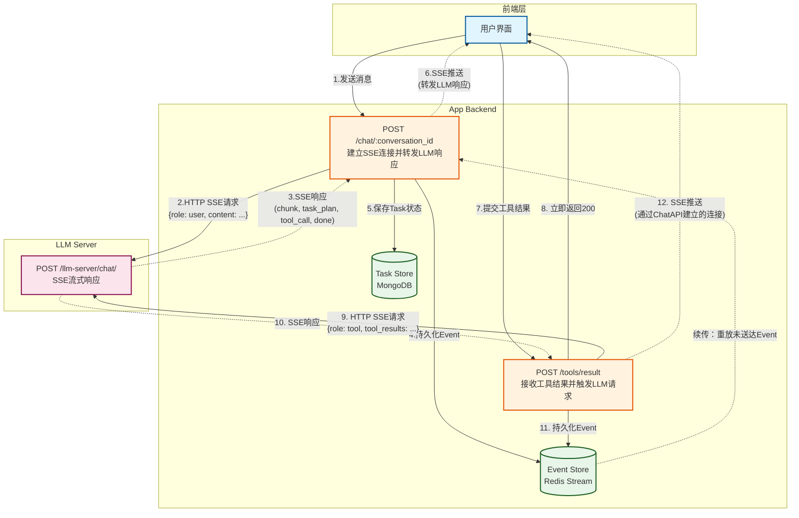

```mermaid
graph TB
    subgraph "前端层"
        UI[用户界面]
    end

    subgraph "App Backend"
        ChatAPI["POST /chat/:conversation_id<br/>建立SSE连接并转发LLM响应"]
        ToolAPI["POST /tools/result<br/>接收工具结果并触发LLM请求"]
        
        EventStore[("Event Store<br/>Redis Stream")]
        TaskStore[("Task Store<br/>MongoDB")]
    end

    subgraph "LLM Server"
        LLMAPI["POST /llm-server/chat/<br/>SSE流式响应"]
    end

    %% 主流程
    UI -->|"1.发送消息"| ChatAPI
    ChatAPI -->|"2.HTTP SSE请求<br/>{role: user, content: ...}"| LLMAPI
    LLMAPI -.->|"3.SSE响应<br/>(chunk, task_plan, tool_call, done)"| ChatAPI
    ChatAPI -->|"4.持久化Event"| EventStore
    ChatAPI -->|"5.保存Task状态"| TaskStore
    ChatAPI -.->|"6.SSE推送<br/>(转发LLM响应)"| UI
    
    %% 工具调用流程
    UI -->|"7.提交工具结果"| ToolAPI
    ToolAPI -->|"8. 立即返回200"| UI
    ToolAPI -->|"9. HTTP SSE请求<br/>{role: tool, tool_results: ...}"| LLMAPI
    LLMAPI -.->|"10. SSE响应"| ToolAPI
    ToolAPI -->|"11. 持久化Event"| EventStore
    ToolAPI -.->|"12. SSE推送<br/>(通过ChatAPI建立的连接)"| UI
    
    %% 续传
    EventStore -.->|"续传：重放未送达Event"| ChatAPI

    classDef frontend fill:#e1f5ff,stroke:#01579b,stroke-width:2px
    classDef backend fill:#fff3e0,stroke:#e65100,stroke-width:2px
    classDef storage fill:#e8f5e9,stroke:#1b5e20,stroke-width:2px
    classDef llm fill:#fce4ec,stroke:#880e4f,stroke-width:2px
    
    class UI frontend
    class ChatAPI,ToolAPI backend
    class EventStore,TaskStore storage
    class LLMAPI llm
```