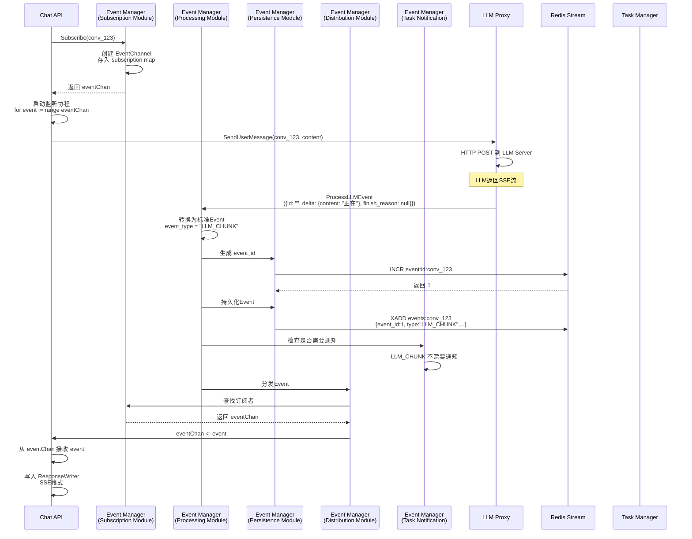

```mermaid
sequenceDiagram
    participant ChatAPI as Chat API
    participant EventMgr as Event Manager<br/>(Subscription Module)
    participant EventProc as Event Manager<br/>(Processing Module)
    participant Persist as Event Manager<br/>(Persistence Module)
    participant Distrib as Event Manager<br/>(Distribution Module)
    participant TaskNotif as Event Manager<br/>(Task Notification)
    participant LLMProxy as LLM Proxy
    participant Redis as Redis Stream
    participant TaskMgr as Task Manager

    ChatAPI->>EventMgr: Subscribe(conv_123)
    EventMgr->>EventMgr: 创建 EventChannel<br/>存入 subscription map
    EventMgr-->>ChatAPI: 返回 eventChan

    ChatAPI->>ChatAPI: 启动监听协程<br/>for event := range eventChan
    
    ChatAPI->>LLMProxy: SendUserMessage(conv_123, content)
    LLMProxy->>LLMProxy: HTTP POST 到 LLM Server

    Note over LLMProxy: LLM返回SSE流

    LLMProxy->>EventProc: ProcessLLMEvent<br/>({id: "", delta: {content: "正在"}, finish_reason: null}})
    
    EventProc->>EventProc: 转换为标准Event<br/>event_type = "LLM_CHUNK"
    EventProc->>Persist: 生成 event_id
    Persist->>Redis: INCR event:id:conv_123
    Redis-->>Persist: 返回 1
    
    EventProc->>Persist: 持久化Event
    Persist->>Redis: XADD events:conv_123<br/>{event_id:1, type:"LLM_CHUNK",...}
    
    EventProc->>TaskNotif: 检查是否需要通知
    TaskNotif->>TaskNotif: LLM_CHUNK 不需要通知
    
    EventProc->>Distrib: 分发Event
    Distrib->>EventMgr: 查找订阅者
    EventMgr-->>Distrib: 返回 eventChan
    Distrib->>ChatAPI: eventChan <- event
    
    ChatAPI->>ChatAPI: 从 eventChan 接收 event
    ChatAPI->>ChatAPI: 写入 ResponseWriter<br/>SSE格式
```