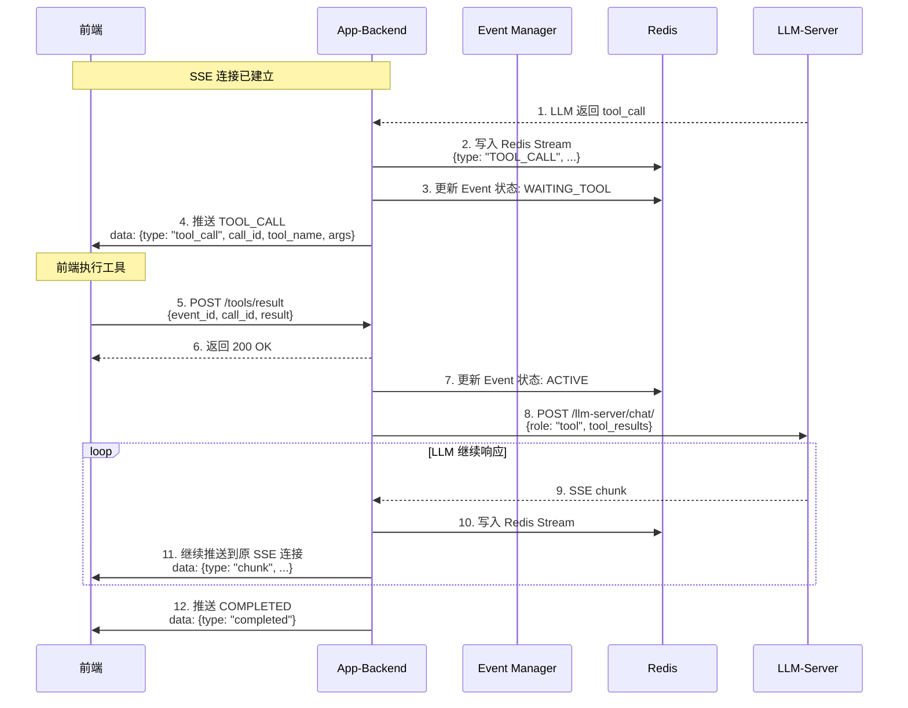

```mermaid
sequenceDiagram
    participant F as 前端
    participant B as App-Backend
    participant E as Event Manager
    participant R as Redis
    participant L as LLM-Server

    Note over F,B: SSE 连接已建立
    
    L-->>B: 1. LLM 返回 tool_call
    
    B->>R: 2. 写入 Redis Stream<br/>{type: "TOOL_CALL", ...}
    B->>R: 3. 更新 Event 状态: WAITING_TOOL
    
    B->>F: 4. 推送 TOOL_CALL<br/>data: {type: "tool_call", call_id, tool_name, args}
    
    Note over F: 前端执行工具
    
    F->>B: 5. POST /tools/result<br/>{event_id, call_id, result}
    B-->>F: 6. 返回 200 OK
    
    B->>R: 7. 更新 Event 状态: ACTIVE
    B->>L: 8. POST /llm-server/chat/<br/>{role: "tool", tool_results}
    
    loop LLM 继续响应
        L-->>B: 9. SSE chunk
        B->>R: 10. 写入 Redis Stream
        B->>F: 11. 继续推送到原 SSE 连接<br/>data: {type: "chunk", ...}
    end
    
    B->>F: 12. 推送 COMPLETED<br/>data: {type: "completed"}
```