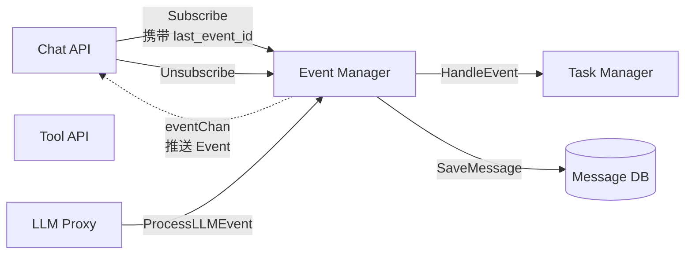

```mermaid
graph LR
  ChatAPI[Chat API]
  ToolAPI[Tool API]
  LLMProxy[LLM Proxy]

  EventMgr[Event Manager]

  ChatAPI -->|Subscribe<br/>携带 last_event_id| EventMgr
  ChatAPI -->|Unsubscribe| EventMgr

  LLMProxy -->|ProcessLLMEvent| EventMgr

  EventMgr -->|HandleEvent| TaskMgr[Task Manager]
  EventMgr -->|SaveMessage| MsgDB[(Message DB)]

  EventMgr -.->|eventChan<br/>推送 Event| ChatAPI
```