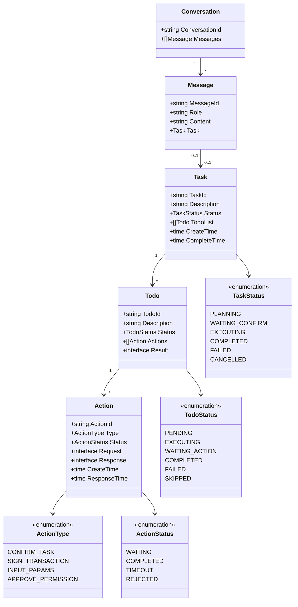

```mermaid
classDiagram
    class Conversation {
        +string ConversationId
        +[]Message Messages
    }
    
    class Message {
        +string MessageId
        +string Role
        +string Content
        +Task Task
    }
    
    class Task {
        +string TaskId
        +string Description
        +TaskStatus Status
        +[]Todo TodoList
        +time CreateTime
        +time CompleteTime
    }
    
    class Todo {
        +string TodoId
        +string Description
        +TodoStatus Status
        +[]Action Actions
        +interface Result
    }
    
    class Action {
        +string ActionId
        +ActionType Type
        +ActionStatus Status
        +interface Request
        +interface Response
        +time CreateTime
        +time ResponseTime
    }
    
    class TaskStatus {
        <<enumeration>>
        PLANNING
        WAITING_CONFIRM
        EXECUTING
        COMPLETED
        FAILED
        CANCELLED
    }
    
    class TodoStatus {
        <<enumeration>>
        PENDING
        EXECUTING
        WAITING_ACTION
        COMPLETED
        FAILED
        SKIPPED
    }
    
    class ActionType {
        <<enumeration>>
        CONFIRM_TASK
        SIGN_TRANSACTION
        INPUT_PARAMS
        APPROVE_PERMISSION
    }
    
    class ActionStatus {
        <<enumeration>>
        WAITING
        COMPLETED
        TIMEOUT
        REJECTED
    }
    
    Conversation "1" --> "*" Message
    Message "0..1" --> "0..1" Task
    Task "1" --> "*" Todo
    Todo "1" --> "*" Action
    Task --> TaskStatus
    Todo --> TodoStatus
    Action --> ActionType
    Action --> ActionStatus
```