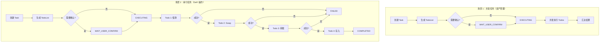

```mermaid
graph TB
    subgraph "场景 1：并发任务（资产管理）"
        A1[创建 Task] --> A2[生成 TodoList]
        A2 --> A3{需要确认?}
        A3 -->|是| A4[WAIT_USER_CONFIRM]
        A3 -->|否| A5[EXECUTING]
        A4 --> A5
        A5 --> A6[并发执行 Todos]
        A6 --> A7[汇总结果]
    end
    
    subgraph "场景 2：串行任务（DeFi 操作）"
        B1[创建 Task] --> B2[生成 TodoList]
        B2 --> B3{需要确认?}
        B3 -->|是| B4[WAIT_USER_CONFIRM]
        B3 -->|否| B5[EXECUTING]
        B4 --> B5
        B5 --> B6[Todo 1: 借款]
        B6 --> B7{成功?}
        B7 -->|是| B8[Todo 2: Swap]
        B7 -->|否| B9[FAILED]
        B8 --> B10{成功?}
        B10 -->|是| B11[Todo 3: 转账]
        B10 -->|否| B9
        B11 --> B12{成功?}
        B12 -->|是| B13[Todo 4: 存入]
        B12 -->|否| B9
        B13 --> B14[COMPLETED]
    end
```