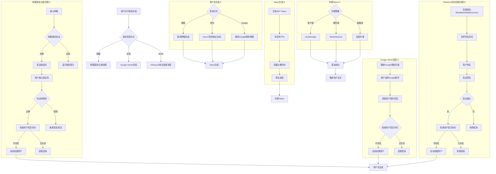

```mermaid
graph TD
    A[用户访问登录页面] --> B{选择登录方式}
    
    B --> |邮箱| C[邮箱登录/注册流程]
    B --> |谷歌| D[Google OAuth流程]
    B --> |SIWE| E[Ethereum钱包连接流程]


    subgraph 邮箱登录/注册流程 C
    C1[输入邮箱] --> C2{邮箱格式验证}
    C2 --> |有效| C3[发送验证码]
    C2 --> |无效| C4[显示错误提示]
    C3 --> C5[用户输入验证码]
    C5 --> C6{验证码校验}
    C6 --> |正确| C7[检查用户是否存在]
    C6 --> |错误| C8[重新发送/重试]
    C7 --> |不存在| C9[自动创建用户]
    C7 --> |已存在| C10[直接登录]
    end


    subgraph Google OAuth流程 D
    D1[跳转Google授权页面] --> D2[用户选择Google账号]
    D2 --> D3[获取用户基本信息]
    D3 --> D4{检查用户是否存在}
    D4 --> |不存在| D5[自动创建用户]
    D4 --> |已存在| D6[直接登录]
    end


    subgraph Ethereum钱包连接流程 E
    E1[连接钱包MetaMask/WalletConnect] --> E2[请求签名消息]
    E2 --> E3[用户签名]
    E3 --> E4[验证签名]
    E4 --> E5{验证通过}
    E5 --> |是| E6[检查用户是否存在]
    E5 --> |否| E7[拒绝登录]
    E6 --> |不存在| E8[自动创建用户]
    E6 --> |已存在| E9[直接登录]
    end


    C9 --> F[用户名生成]
    D5 --> F
    E8 --> F


    subgraph 用户名生成 F
    F1{登录方式} --> |邮箱| F2[使用邮箱前缀]
    F1 --> |钱包| F3[Dora+钱包地址后6位]
    F1 --> |Google| F4[使用Google昵称/邮箱]
    end


    F2 --> G[Token生成]
    F3 --> G
    F4 --> G


    subgraph Token生成 G
    G1[生成JWT Token] --> G2[包含用户ID]
    G2 --> G3[设置过期时间]
    G3 --> G4[签名加密]
    end


    G4 --> H[存储Token]


    subgraph 存储Token H
    H1{存储策略} --> |客户端| H2[localStorage]
    H1 --> |服务端| H3[Redis/Session]
    H1 --> |数据库| H4[加密存储]
    end


    H2 --> I[登录成功]
    H3 --> I
    H4 --> I
    
    I --> J[跳转用户主页]
```