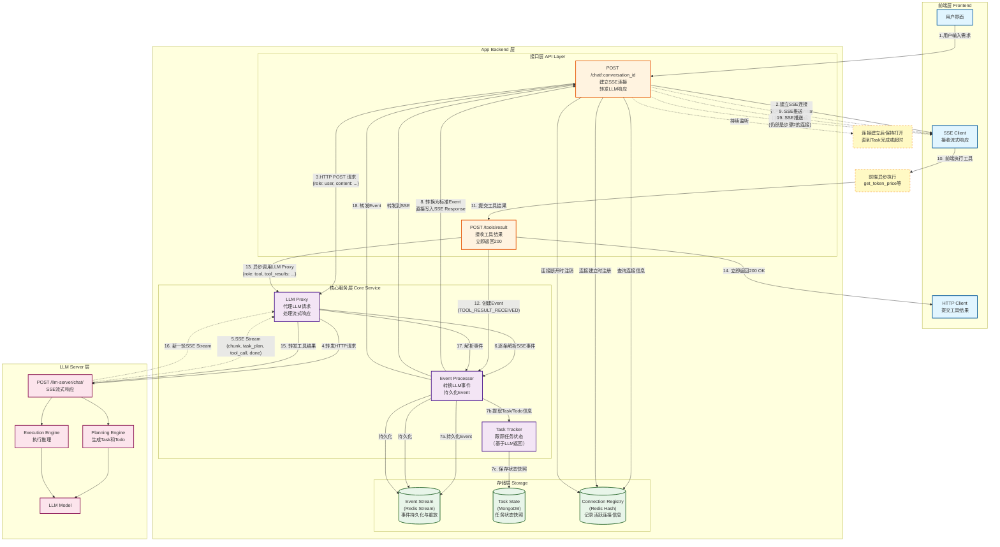

```mermaid
graph TB
    subgraph "前端层 Frontend"
        UI[用户界面]
        SSE_Client[SSE Client<br/>接收流式响应]
        HTTP_Client[HTTP Client<br/>提交工具结果]
    end

    subgraph "App Backend 层"
        direction TB
        
        subgraph "接口层 API Layer"
            Chat_API["POST /chat/:conversation_id<br/>建立SSE连接<br/>转发LLM响应"]
            Tool_API["POST /tools/result<br/>接收工具结果<br/>立即返回200"]
        end
        
        subgraph "核心服务层 Core Service"
            LLM_Proxy["LLM Proxy<br/>代理LLM请求<br/>处理流式响应"]
            Event_Processor["Event Processor<br/>转换LLM事件<br/>持久化Event"]
            Task_Tracker["Task Tracker<br/>跟踪任务状态<br/>（基于LLM返回）"]
        end
        
        subgraph "存储层 Storage"
            Event_Stream[("Event Stream<br/>(Redis Stream)<br/>事件持久化与重放")]
            Task_State[("Task State<br/>(MongoDB)<br/>任务状态快照")]
            Conn_Registry[("Connection Registry<br/>(Redis Hash)<br/>记录活跃连接信息")]
        end
    end

    subgraph "LLM Server 层"
        LLM_API["POST /llm-server/chat/<br/>SSE流式响应"]
        Planning_Engine[Planning Engine<br/>生成Task和Todo]
        Execution_Engine[Execution Engine<br/>执行推理]
        Model[LLM Model]
    end

    %% ===== 用户发送消息流程 =====
    UI -->|"1.用户输入需求"| Chat_API
    Chat_API -->|"2.建立SSE连接<br/>返回ResponseWriter"| SSE_Client
    Note1["连接建立后保持打开<br/>直到Task完成或超时"]
    Chat_API -.->|"持续监听"| Note1
    
    Chat_API -->|"3.HTTP POST 请求<br/>{role: user, content: ...}"| LLM_Proxy
    
    LLM_Proxy -->|"4.转发HTTP请求"| LLM_API
    LLM_API -.->|"5.SSE Stream<br/>(chunk, task_plan, tool_call, done)"| LLM_Proxy
    
    %% ===== LLM响应处理流程 =====
    LLM_Proxy -->|"6.逐条解析SSE事件"| Event_Processor
    
    Event_Processor -->|"7a.持久化Event"| Event_Stream
    Event_Processor -->|"7b.提取Task/Todo信息"| Task_Tracker
    Task_Tracker -->|"7c. 保存状态快照"| Task_State
    
    Event_Processor -->|"8. 转换为标准Event<br/>直接写入SSE Response"| Chat_API
    Chat_API -.->|"9. SSE推送<br/>(复用步骤2的连接)"| SSE_Client
    
    %% ===== 工具调用流程 =====
    SSE_Client -->|"10. 前端执行工具"| Note2["前端异步执行<br/>get_token_price等"]
    Note2 -->|"11. 提交工具结果"| Tool_API
    
    Tool_API -->|"12. 创建Event<br/>(TOOL_RESULT_RECEIVED)"| Event_Processor
    Event_Processor -->|"持久化"| Event_Stream
    Event_Processor -->|"转发到SSE"| Chat_API
    Chat_API -.->|"推送确认Event"| SSE_Client
    
    Tool_API -->|"13. 异步调用LLM Proxy<br/>{role: tool, tool_results: ...}"| LLM_Proxy
    Tool_API -->|"14. 立即返回200 OK"| HTTP_Client
    
    %% ===== 第二轮LLM响应 =====
    LLM_Proxy -->|"15. 转发工具结果"| LLM_API
    LLM_API -.->|"16. 新一轮SSE Stream"| LLM_Proxy
    LLM_Proxy -->|"17. 解析事件"| Event_Processor
    Event_Processor -->|"持久化"| Event_Stream
    Event_Processor -->|"18. 转发Event"| Chat_API
    Chat_API -.->|"19. SSE推送<br/>(仍然是步骤2的连接)"| SSE_Client
    
    %% ===== 内部依赖 =====
    Chat_API -->|"查询连接信息"| Conn_Registry
    Chat_API -->|"连接建立时注册"| Conn_Registry
    Chat_API -->|"连接断开时注销"| Conn_Registry
    
    LLM_API --> Planning_Engine
    LLM_API --> Execution_Engine
    Planning_Engine --> Model
    Execution_Engine --> Model
    
    %% ===== 样式 =====
    classDef frontend fill:#e1f5ff,stroke:#01579b,stroke-width:2px
    classDef api fill:#fff3e0,stroke:#e65100,stroke-width:2px
    classDef service fill:#f3e5f5,stroke:#4a148c,stroke-width:2px
    classDef storage fill:#e8f5e9,stroke:#1b5e20,stroke-width:2px
    classDef llm fill:#fce4ec,stroke:#880e4f,stroke-width:2px
    classDef note fill:#fff9c4,stroke:#f57f17,stroke-width:1px,stroke-dasharray: 5 5
    
    class UI,SSE_Client,HTTP_Client frontend
    class Chat_API,Tool_API api
    class LLM_Proxy,Event_Processor,Task_Tracker service
    class Event_Stream,Task_State,Conn_Registry storage
    class LLM_API,Planning_Engine,Execution_Engine,Model llm
    class Note1,Note2 note
```