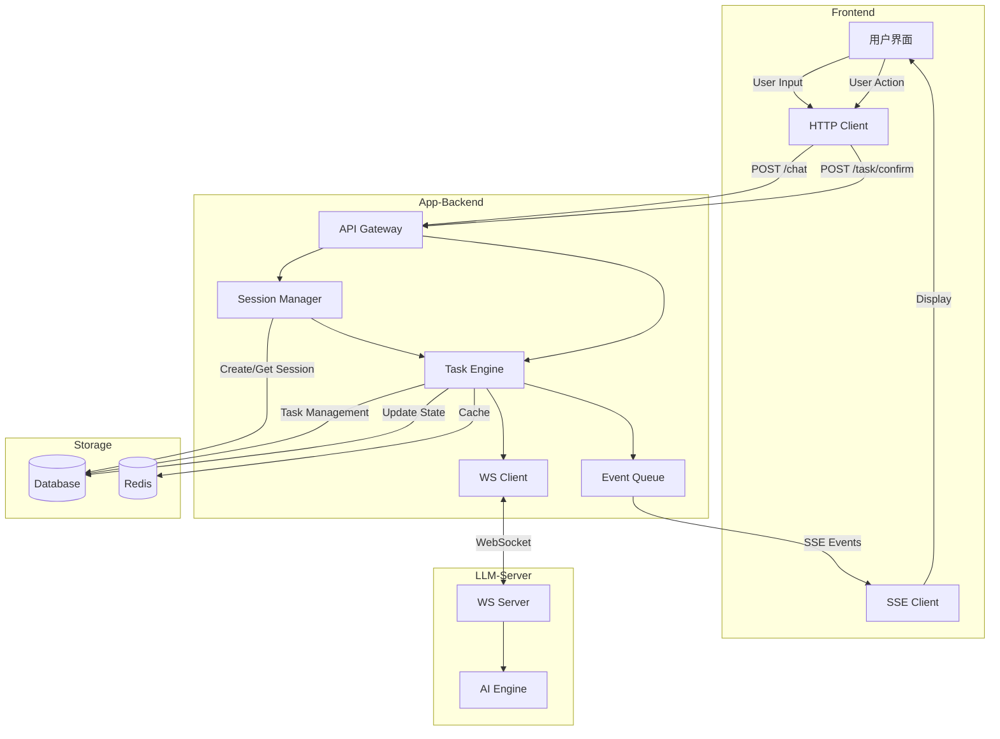

```mermaid
graph TB
    subgraph Frontend
        A[用户界面]
        B[SSE Client]
        C[HTTP Client]
    end
    
    subgraph App-Backend
        D[API Gateway]
        E[Session Manager]
        F[Task Engine]
        G[WS Client]
        H[Event Queue]
    end
    
    subgraph Storage
        I[(Database)]
        J[(Redis)]
    end
    
    subgraph LLM-Server
        K[WS Server]
        L[AI Engine]
    end
    
    A -->|User Input| C
    C -->|POST /chat| D
    D --> E
    E -->|Create/Get Session| I
    E --> F
    F -->|Task Management| I
    F --> G
    G <-->|WebSocket| K
    K --> L
    F --> H
    H -->|SSE Events| B
    B -->|Display| A
    A -->|User Action| C
    C -->|POST /task/confirm| D
    D --> F
    F -->|Update State| I
    F -->|Cache| J
```