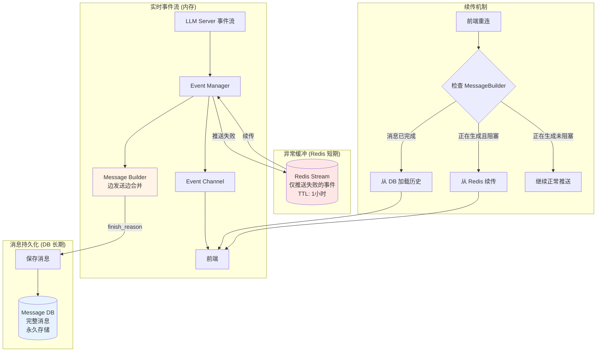

```mermaid
graph TB
    subgraph "实时事件流 (内存)"
        LLM[LLM Server 事件流]
        EventMgr[Event Manager]
        Builder[Message Builder<br/>边发送边合并]
        Channel[Event Channel]
        
        LLM --> EventMgr
        EventMgr --> Builder
        EventMgr --> Channel
        Channel --> Frontend[前端]
    end
    
    subgraph "异常缓冲 (Redis 短期)"
        Redis[(Redis Stream<br/>仅推送失败的事件<br/>TTL: 1小时)]
        
        EventMgr -->|推送失败| Redis
        Redis -->|续传| EventMgr
    end
    
    subgraph "消息持久化 (DB 长期)"
        MsgDB[(Message DB<br/>完整消息<br/>永久存储)]
        
        Builder -->|finish_reason| SaveMsg[保存消息]
        SaveMsg --> MsgDB
    end
    
    subgraph "续传机制"
        Reconnect[前端重连]
        CheckBuilder{检查 MessageBuilder}
        
        Reconnect --> CheckBuilder
        CheckBuilder -->|消息已完成| LoadHistory[从 DB 加载历史]
        CheckBuilder -->|正在生成且阻塞| LoadRedis[从 Redis 续传]
        CheckBuilder -->|正在生成未阻塞| NoReplay[继续正常推送]
        
        LoadHistory --> Frontend
        LoadRedis --> Frontend
    end
    
    style Builder fill:#fff4e6
    style Redis fill:#ffe6e6
    style MsgDB fill:#e6f3ff
    style EventMgr fill:#f
```