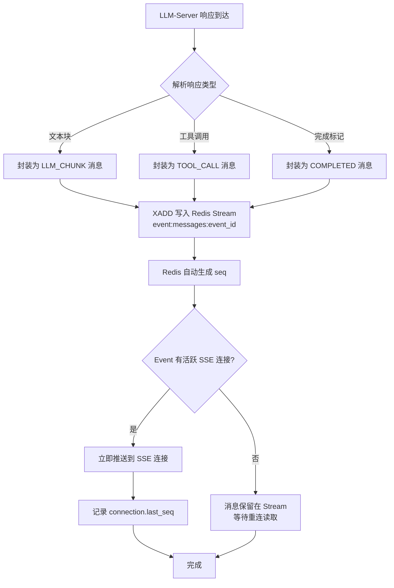

```mermaid
flowchart TD
    A[LLM-Server 响应到达] --> B{解析响应类型}
    
    B -->|文本块| C[封装为 LLM_CHUNK 消息]
    B -->|工具调用| D[封装为 TOOL_CALL 消息]
    B -->|完成标记| E[封装为 COMPLETED 消息]
    
    C --> F[XADD 写入 Redis Stream<br/>event:messages:event_id]
    D --> F
    E --> F
    
    F --> G[Redis 自动生成 seq]
    
    G --> H{Event 有活跃 SSE 连接?}
    
    H -->|是| I[立即推送到 SSE 连接]
    H -->|否| J[消息保留在 Stream<br/>等待重连读取]
    
    I --> K[记录 connection.last_seq]
    
    K --> L[完成]
    J --> L
```