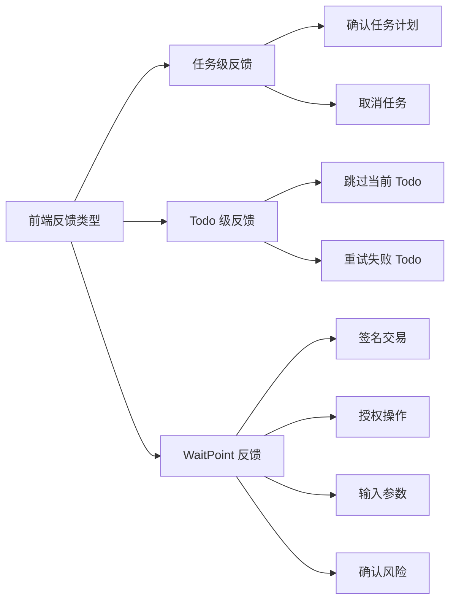

```mermaid
graph LR
    A[前端反馈类型] --> B[任务级反馈]
    A --> C[Todo 级反馈]
    A --> D[WaitPoint 反馈]
    
    B --> B1[确认任务计划]
    B --> B2[取消任务]
    
    C --> C1[跳过当前 Todo]
    C --> C2[重试失败 Todo]
    
    D --> D1[签名交易]
    D --> D2[授权操作]
    D --> D3[输入参数]
    D --> D4[确认风险]
```