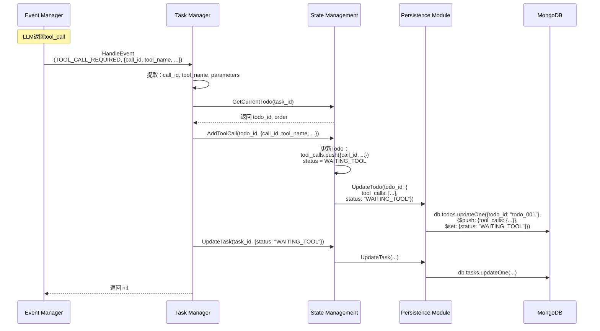

```mermaid
sequenceDiagram
    participant EventMgr as Event Manager
    participant TaskMgr as Task Manager
    participant StateMgr as State Management
    participant Persist as Persistence Module
    participant MongoDB as MongoDB

    Note over EventMgr: LLM返回tool_call

    EventMgr->>TaskMgr: HandleEvent<br/>(TOOL_CALL_REQUIRED, {call_id, tool_name, ...})
    
    TaskMgr->>TaskMgr: 提取：call_id, tool_name, parameters
    
    TaskMgr->>StateMgr: GetCurrentTodo(task_id)
    StateMgr-->>TaskMgr: 返回 todo_id, order
    
    TaskMgr->>StateMgr: AddToolCall(todo_id, {call_id, tool_name, ...})
    
    StateMgr->>StateMgr: 更新Todo：<br/>tool_calls.push({call_id, ...})<br/>status = WAITING_TOOL
    
    StateMgr->>Persist: UpdateTodo(todo_id, {<br/>  tool_calls: [...],<br/>  status: "WAITING_TOOL"})
    
    Persist->>MongoDB: db.todos.updateOne({todo_id: "todo_001"},<br/>  {$push: {tool_calls: {...}},<br/>   $set: {status: "WAITING_TOOL"}})
    
    TaskMgr->>StateMgr: UpdateTask(task_id, {status: "WAITING_TOOL"})
    StateMgr->>Persist: UpdateTask(...)
    Persist->>MongoDB: db.tasks.updateOne(...)
    
    TaskMgr-->>EventMgr: 返回 nil
```