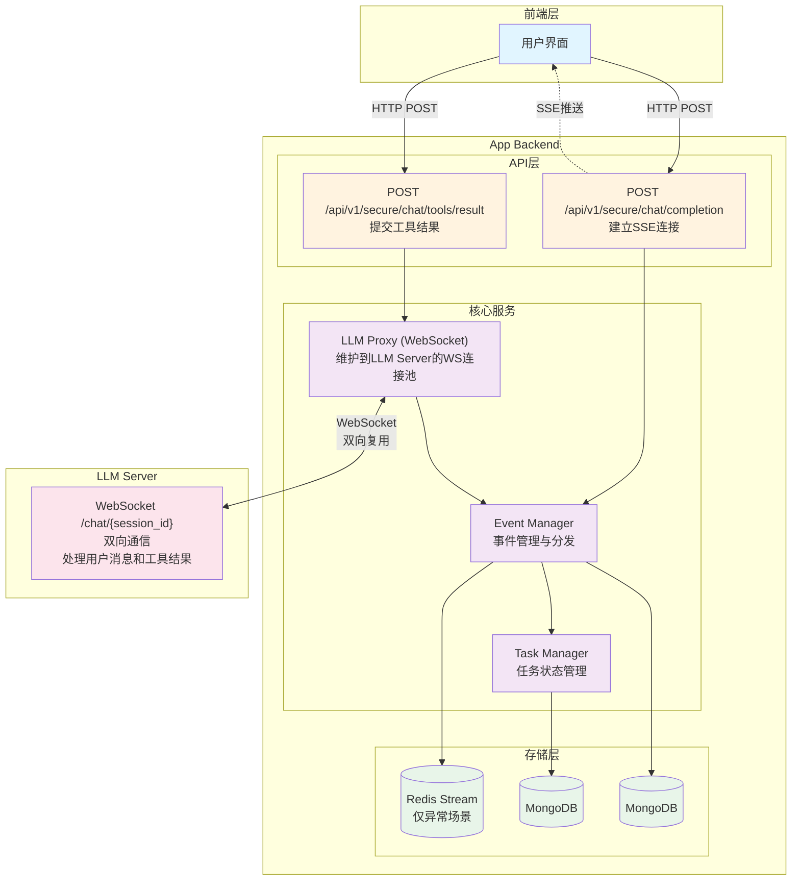

```mermaid
graph TB
  subgraph "前端层"
    UI[用户界面]
  end

  subgraph "App Backend"
    direction TB

    subgraph "API层"
      ChatAPI["POST /api/v1/secure/chat/completion<br/>建立SSE连接"]
      ToolAPI["POST /api/v1/secure/chat/tools/result<br/>提交工具结果"]
    end

    subgraph "核心服务"
      EventMgr["Event Manager<br/>事件管理与分发"]
      TaskMgr["Task Manager<br/>任务状态管理"]
      LLMProxy["LLM Proxy (WebSocket)<br/>维护到LLM Server的WS连接池"]
    end

    subgraph "存储层"
      EventStore[("Redis Stream<br/>仅异常场景")]
      TaskStore[("MongoDB")]
      MessageStore[("MongoDB")]
    end
  end

  subgraph "LLM Server"
    LLMWS["WebSocket /chat/{session_id}<br/>双向通信<br/>处理用户消息和工具结果"]
  end

  UI -->|"HTTP POST"| ChatAPI
  UI -->|"HTTP POST"| ToolAPI
  ChatAPI -.->|"SSE推送"| UI
  
  ChatAPI --> EventMgr
  ToolAPI --> LLMProxy
  
  LLMProxy <-->|"WebSocket<br/>双向复用"| LLMWS
  
  LLMProxy --> EventMgr
  EventMgr --> TaskMgr
  EventMgr --> EventStore
  EventMgr --> MessageStore
  TaskMgr --> TaskStore

  classDef frontend fill:#e1f5ff
  classDef api fill:#fff3e0
  classDef service fill:#f3e5f5
  classDef storage fill:#e8f5e9
  classDef llm fill:#fce4ec

  class UI frontend
  class ChatAPI,ToolAPI api
  class EventMgr,TaskMgr,LLMProxy service
  class EventStore,TaskStore,MessageStore storage
  class LLMWS llm
```