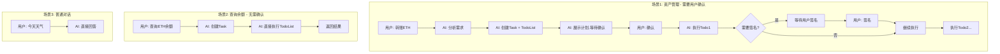

```mermaid
graph TB
    subgraph "场景1: 资产管理 - 需要用户确认"
        A1[用户: 转账ETH] --> A2[AI: 分析需求]
        A2 --> A3[AI: 创建Task + TodoList]
        A3 --> A4[AI: 展示计划,等待确认]
        A4 --> A5[用户: 确认]
        A5 --> A6[AI: 执行Todo1]
        A6 --> A7{需要签名?}
        A7 -->|是| A8[等待用户签名]
        A8 --> A9[用户: 签名]
        A9 --> A10[继续执行]
        A7 -->|否| A10
        A10 --> A11[执行Todo2...]
    end
    
    subgraph "场景2: 查询余额 - 无需确认"
        B1[用户: 查询ETH余额] --> B2[AI: 创建Task]
        B2 --> B3[AI: 直接执行TodoList]
        B3 --> B4[返回结果]
    end
    
    subgraph "场景3: 普通对话"
        C1[用户: 今天天气] --> C2[AI: 直接回答]
    end
```