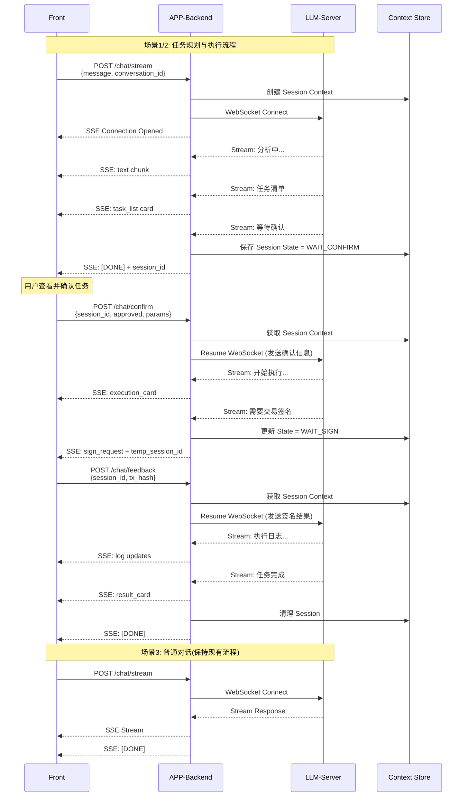

```mermaid
sequenceDiagram
    participant F as Front
    participant AB as APP-Backend
    participant LLM as LLM-Server
    participant Store as Context Store
    
    Note over F,LLM: 场景1/2: 任务规划与执行流程
    
    F->>AB: POST /chat/stream<br/>{message, conversation_id}
    AB->>Store: 创建 Session Context
    AB->>LLM: WebSocket Connect
    AB-->>F: SSE Connection Opened
    
    LLM-->>AB: Stream: 分析中...
    AB-->>F: SSE: text chunk
    
    LLM-->>AB: Stream: 任务清单
    AB-->>F: SSE: task_list card
    
    LLM-->>AB: Stream: 等待确认
    AB->>Store: 保存 Session State = WAIT_CONFIRM
    AB-->>F: SSE: [DONE] + session_id
    
    Note over F: 用户查看并确认任务
    
    F->>AB: POST /chat/confirm<br/>{session_id, approved, params}
    AB->>Store: 获取 Session Context
    AB->>LLM: Resume WebSocket (发送确认信息)
    
    LLM-->>AB: Stream: 开始执行...
    AB-->>F: SSE: execution_card
    
    LLM-->>AB: Stream: 需要交易签名
    AB->>Store: 更新 State = WAIT_SIGN
    AB-->>F: SSE: sign_request + temp_session_id
    
    F->>AB: POST /chat/feedback<br/>{session_id, tx_hash}
    AB->>Store: 获取 Session Context
    AB->>LLM: Resume WebSocket (发送签名结果)
    
    LLM-->>AB: Stream: 执行日志...
    AB-->>F: SSE: log updates
    
    LLM-->>AB: Stream: 任务完成
    AB-->>F: SSE: result_card
    AB->>Store: 清理 Session
    AB-->>F: SSE: [DONE]
    
    Note over F,LLM: 场景3: 普通对话(保持现有流程)
    
    F->>AB: POST /chat/stream
    AB->>LLM: WebSocket Connect
    LLM-->>AB: Stream Response
    AB-->>F: SSE Stream
    AB-->>F: SSE: [DONE]
```