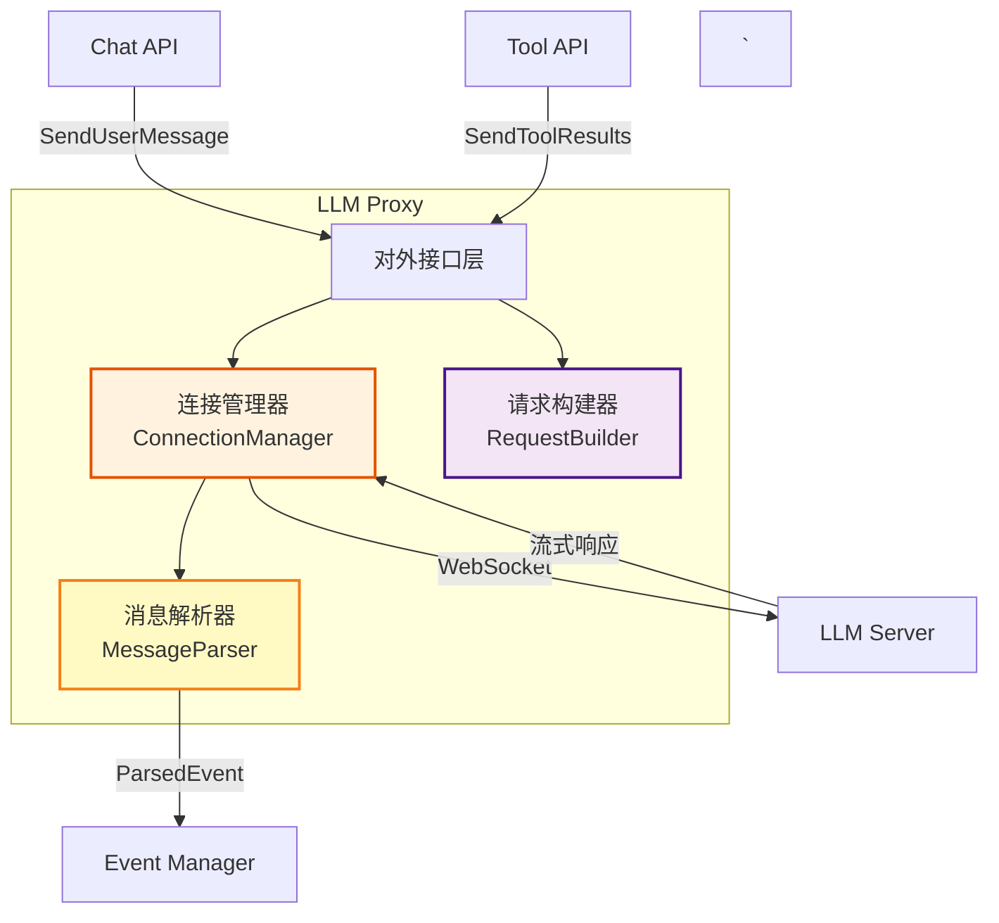

```mermaid
graph TB
    subgraph LLMProxy[LLM Proxy]
        direction TB
        API[对外接口层]
        ConnMgr[连接管理器<br/>ConnectionManager]
        ReqBuilder[请求构建器<br/>RequestBuilder]
        MsgParser[消息解析器<br/>MessageParser]
    end
    
    ChatAPI[Chat API] -->|SendUserMessage| API
    ToolAPI[Tool API] -->|SendToolResults| API
    
    API --> ConnMgr
    API --> ReqBuilder
    
    ConnMgr -->|WebSocket| LLMServer[LLM Server]
    LLMServer -->|流式响应| ConnMgr
    
    ConnMgr --> MsgParser
    MsgParser -->|ParsedEvent| EventMgr[Event Manager]
    
    style ConnMgr fill:#fff3e0,stroke:#e65100,stroke-width:2px
    style MsgParser fill:#fff9c4,stroke:#f57f17,stroke-width:2px
    style ReqBuilder fill:#f3e5f5,stroke:#4a148c,stroke-width:2px
`
```