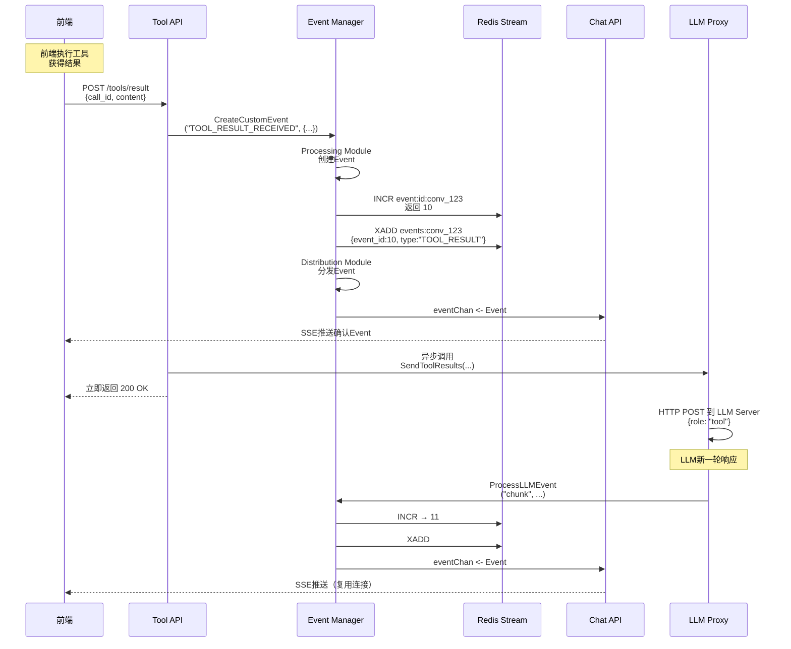

```mermaid
sequenceDiagram
    participant FE as 前端
    participant ToolAPI as Tool API
    participant EventMgr as Event Manager
    participant Redis as Redis Stream
    participant ChatAPI as Chat API
    participant LLMProxy as LLM Proxy

    Note over FE: 前端执行工具<br/>获得结果

    FE->>ToolAPI: POST /tools/result<br/>{call_id, content}
    
    ToolAPI->>EventMgr: CreateCustomEvent<br/>("TOOL_RESULT_RECEIVED", {...})
    
    EventMgr->>EventMgr: Processing Module<br/>创建Event
    EventMgr->>Redis: INCR event:id:conv_123<br/>返回 10
    EventMgr->>Redis: XADD events:conv_123<br/>{event_id:10, type:"TOOL_RESULT"}
    
    EventMgr->>EventMgr: Distribution Module<br/>分发Event
    EventMgr->>ChatAPI: eventChan <- Event
    ChatAPI-->>FE: SSE推送确认Event
    
    ToolAPI->>LLMProxy: 异步调用<br/>SendToolResults(...)
    ToolAPI-->>FE: 立即返回 200 OK
    
    LLMProxy->>LLMProxy: HTTP POST 到 LLM Server<br/>{role: "tool"}
    
    Note over LLMProxy: LLM新一轮响应
    
    LLMProxy->>EventMgr: ProcessLLMEvent<br/>("chunk", ...)
    EventMgr->>Redis: INCR → 11
    EventMgr->>Redis: XADD
    EventMgr->>ChatAPI: eventChan <- Event
    ChatAPI-->>FE: SSE推送（复用连接）
```