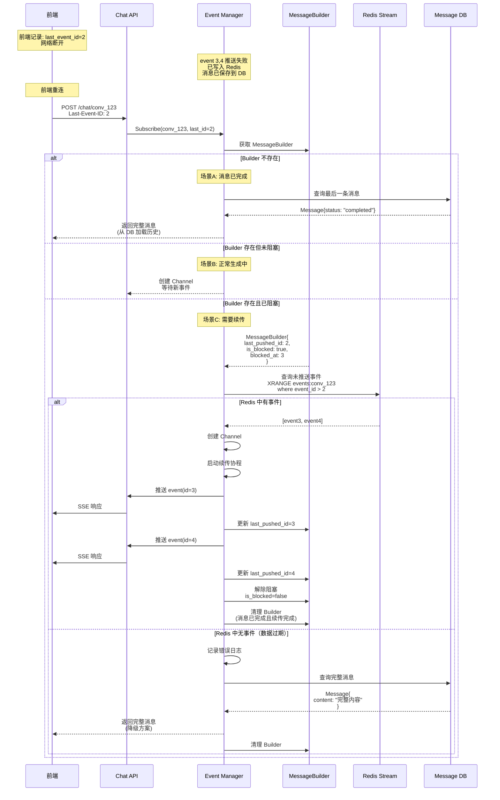

```mermaid
sequenceDiagram
    participant FE as 前端
    participant ChatAPI as Chat API
    participant EventMgr as Event Manager
    participant Builder as MessageBuilder
    participant Redis as Redis Stream
    participant MsgDB as Message DB

    Note over FE: 前端记录: last_event_id=2<br/>网络断开
    
    Note over EventMgr: event 3,4 推送失败<br/>已写入 Redis<br/>消息已保存到 DB
    
    Note over FE: 前端重连
    
    FE->>ChatAPI: POST /chat/conv_123<br/>Last-Event-ID: 2
    
    ChatAPI->>EventMgr: Subscribe(conv_123, last_id=2)
    
    EventMgr->>Builder: 获取 MessageBuilder
    
    alt Builder 不存在
        Note over EventMgr: 场景A: 消息已完成
        EventMgr->>MsgDB: 查询最后一条消息
        MsgDB-->>EventMgr: Message{status: "completed"}
        EventMgr-->>FE: 返回完整消息<br/>(从 DB 加载历史)
        
    else Builder 存在但未阻塞
        Note over EventMgr: 场景B: 正常生成中
        EventMgr-->>ChatAPI: 创建 Channel<br/>等待新事件
        
    else Builder 存在且已阻塞
        Note over EventMgr: 场景C: 需要续传
        
        Builder-->>EventMgr: MessageBuilder{<br/>  last_pushed_id: 2,<br/>  is_blocked: true,<br/>  blocked_at: 3<br/>}
        
        EventMgr->>Redis: 查询未推送事件<br/>XRANGE events:conv_123<br/>where event_id > 2
        
        alt Redis 中有事件
            Redis-->>EventMgr: [event3, event4]
            
            EventMgr->>EventMgr: 创建 Channel
            EventMgr->>EventMgr: 启动续传协程
            
            EventMgr->>ChatAPI: 推送 event(id=3)
            ChatAPI->>FE: SSE 响应
            EventMgr->>Builder: 更新 last_pushed_id=3
            
            EventMgr->>ChatAPI: 推送 event(id=4)
            ChatAPI->>FE: SSE 响应
            EventMgr->>Builder: 更新 last_pushed_id=4
            
            EventMgr->>Builder: 解除阻塞<br/>is_blocked=false
            
            EventMgr->>Builder: 清理 Builder<br/>(消息已完成且续传完成)
            
        else Redis 中无事件（数据过期）
            EventMgr->>EventMgr: 记录错误日志
            EventMgr->>MsgDB: 查询完整消息
            MsgDB-->>EventMgr: Message{<br/>  content: "完整内容"<br/>}
            EventMgr-->>FE: 返回完整消息<br/>(降级方案)
            EventMgr->>Builder: 清理 Builder
        end
    end
```