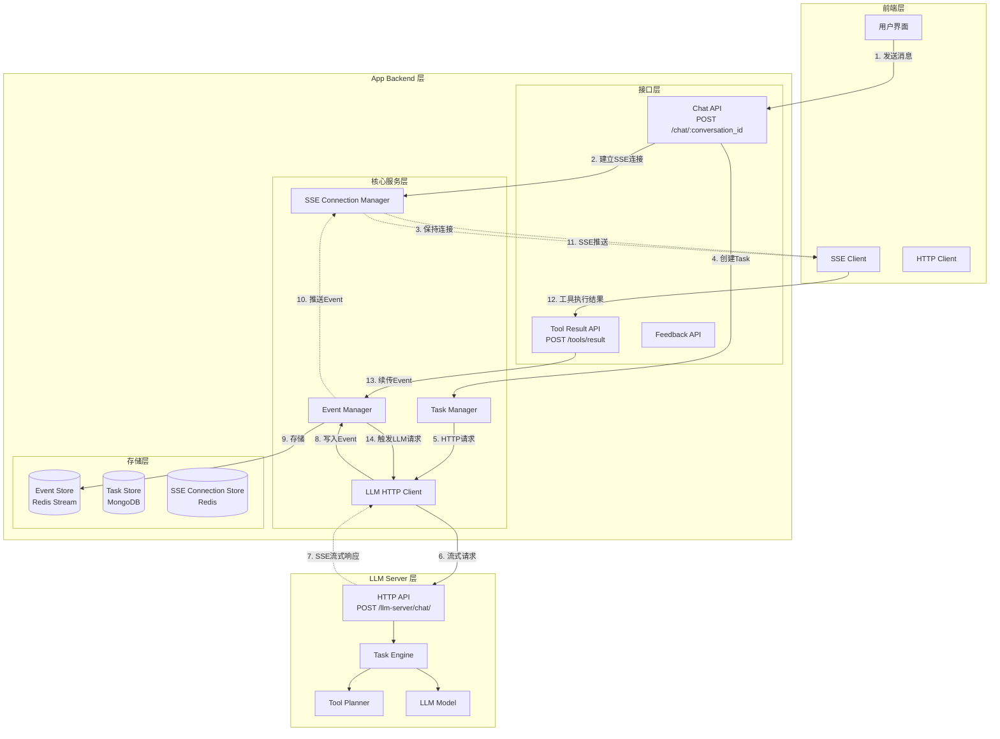

```mermaid
graph TB
    subgraph "前端层"
        UI[用户界面]
        SSE_Client[SSE Client]
        HTTP_Client[HTTP Client]
    end

    subgraph "App Backend 层"
        direction TB
        
        subgraph "接口层"
            Chat_API[Chat API<br/>POST /chat/:conversation_id]
            Tool_API[Tool Result API<br/>POST /tools/result]
            Feedback_API[Feedback API]
        end
        
        subgraph "核心服务层"
            SSE_Mgr[SSE Connection Manager]
            Event_Mgr[Event Manager]
            Task_Mgr[Task Manager]
            LLM_Client[LLM HTTP Client]
        end
        
        subgraph "存储层"
            Event_Store[(Event Store<br/>Redis Stream)]
            Task_Store[(Task Store<br/>MongoDB)]
            SSE_Store[(SSE Connection Store<br/>Redis)]
        end
    end

    subgraph "LLM Server 层"
        LLM_API[HTTP API<br/>POST /llm-server/chat/]
        Task_Engine[Task Engine]
        Tool_Planner[Tool Planner]
        Model[LLM Model]
    end

    UI -->|1. 发送消息| Chat_API
    Chat_API -->|2. 建立SSE连接| SSE_Mgr
    SSE_Mgr -.->|3. 保持连接| SSE_Client
    
    Chat_API -->|4. 创建Task| Task_Mgr
    Task_Mgr -->|5. HTTP请求| LLM_Client
    LLM_Client -->|6. 流式请求| LLM_API
    
    LLM_API -.->|7. SSE流式响应| LLM_Client
    LLM_Client -->|8. 写入Event| Event_Mgr
    Event_Mgr -->|9. 存储| Event_Store
    Event_Mgr -.->|10. 推送Event| SSE_Mgr
    SSE_Mgr -.->|11. SSE推送| SSE_Client
    
    SSE_Client -->|12. 工具执行结果| Tool_API
    Tool_API -->|13. 续传Event| Event_Mgr
    Event_Mgr -->|14. 触发LLM请求| LLM_Client
    
    LLM_API --> Task_Engine
    Task_Engine --> Tool_Planner
    Task_Engine --> Model
```