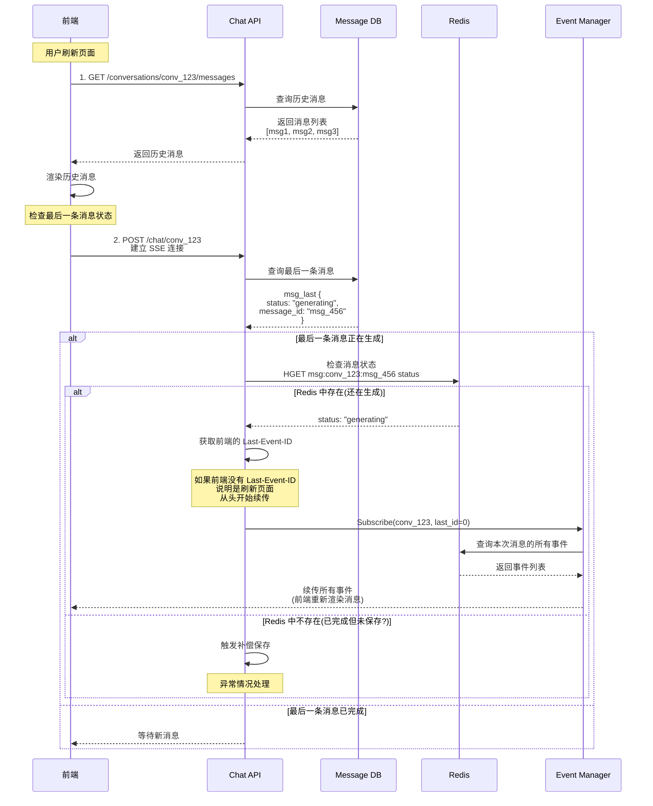

```mermaid
sequenceDiagram
    participant FE as 前端
    participant API as Chat API
    participant MsgDB as Message DB
    participant Redis as Redis
    participant EM as Event Manager
    
    Note over FE: 用户刷新页面
    
    FE->>API: 1. GET /conversations/conv_123/messages
    
    API->>MsgDB: 查询历史消息
    MsgDB-->>API: 返回消息列表<br/>[msg1, msg2, msg3]
    
    API-->>FE: 返回历史消息
    FE->>FE: 渲染历史消息
    
    Note over FE: 检查最后一条消息状态
    
    FE->>API: 2. POST /chat/conv_123<br/>建立 SSE 连接
    
    API->>MsgDB: 查询最后一条消息
    MsgDB-->>API: msg_last {<br/>  status: "generating",<br/>  message_id: "msg_456"<br/>}
    
    alt 最后一条消息正在生成
        API->>Redis: 检查消息状态<br/>HGET msg:conv_123:msg_456 status
        
        alt Redis 中存在(还在生成)
            Redis-->>API: status: "generating"
            
            API->>API: 获取前端的 Last-Event-ID
            Note over API: 如果前端没有 Last-Event-ID<br/>说明是刷新页面<br/>从头开始续传
            
            API->>EM: Subscribe(conv_123, last_id=0)
            EM->>Redis: 查询本次消息的所有事件
            Redis-->>EM: 返回事件列表
            
            EM-->>FE: 续传所有事件<br/>(前端重新渲染消息)
            
        else Redis 中不存在(已完成但未保存?)
            API->>API: 触发补偿保存
            Note over API: 异常情况处理
        end
        
    else 最后一条消息已完成
        API-->>FE: 等待新消息
    end
```