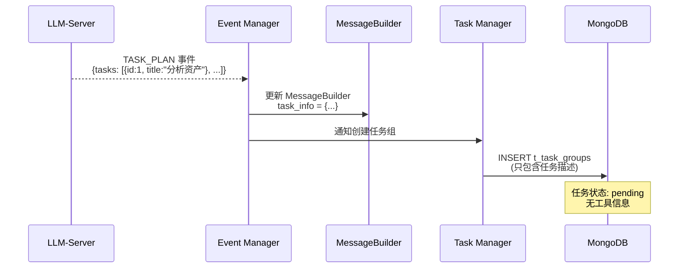

```mermaid
sequenceDiagram
    participant LLM as LLM-Server
    participant EM as Event Manager
    participant Builder as MessageBuilder
    participant TaskMgr as Task Manager
    participant DB as MongoDB

    LLM-->>EM: TASK_PLAN 事件<br/>{tasks: [{id:1, title:"分析资产"}, ...]}
    
    EM->>Builder: 更新 MessageBuilder<br/>task_info = {...}
    
    EM->>TaskMgr: 通知创建任务组
    
    TaskMgr->>DB: INSERT t_task_groups<br/>(只包含任务描述)
    
    Note over DB: 任务状态: pending<br/>无工具信息
```