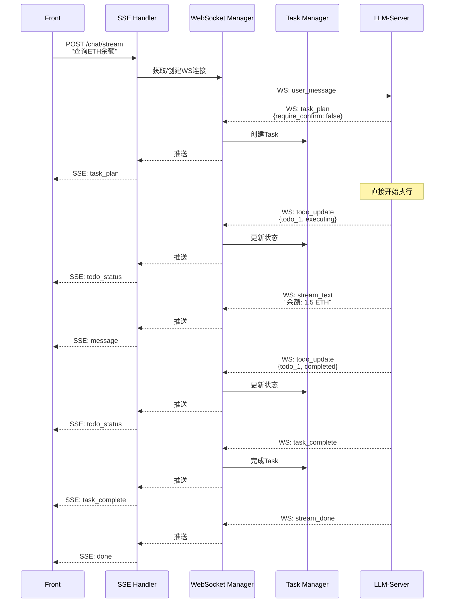

```mermaid
sequenceDiagram
    participant F as Front
    participant SH as SSE Handler
    participant WM as WebSocket Manager
    participant TM as Task Manager
    participant L as LLM-Server
    
    F->>SH: POST /chat/stream<br/>"查询ETH余额"
    SH->>WM: 获取/创建WS连接
    WM->>L: WS: user_message
    
    L-->>WM: WS: task_plan<br/>{require_confirm: false}
    WM->>TM: 创建Task
    WM-->>SH: 推送
    SH-->>F: SSE: task_plan
    
    Note over L: 直接开始执行
    
    L-->>WM: WS: todo_update<br/>{todo_1, executing}
    WM->>TM: 更新状态
    WM-->>SH: 推送
    SH-->>F: SSE: todo_status
    
    L-->>WM: WS: stream_text<br/>"余额: 1.5 ETH"
    WM-->>SH: 推送
    SH-->>F: SSE: message
    
    L-->>WM: WS: todo_update<br/>{todo_1, completed}
    WM->>TM: 更新状态
    WM-->>SH: 推送
    SH-->>F: SSE: todo_status
    
    L-->>WM: WS: task_complete
    WM->>TM: 完成Task
    WM-->>SH: 推送
    SH-->>F: SSE: task_complete
    
    L-->>WM: WS: stream_done
    WM-->>SH: 推送
    SH-->>F: SSE: done
```