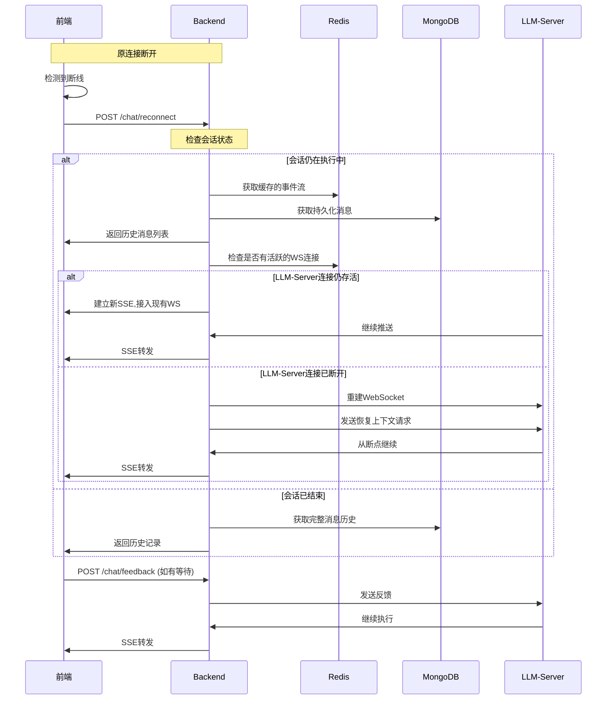

```mermaid
sequenceDiagram
    participant F as 前端
    participant B as Backend
    participant R as Redis
    participant M as MongoDB
    participant L as LLM-Server
    
    Note over F,B: 原连接断开
    F->>F: 检测到断线
    
    F->>B: POST /chat/reconnect
    Note over B: 检查会话状态
    
    alt 会话仍在执行中
        B->>R: 获取缓存的事件流
        B->>M: 获取持久化消息
        B->>F: 返回历史消息列表
        
        B->>R: 检查是否有活跃的WS连接
        alt LLM-Server连接仍存活
            B->>F: 建立新SSE,接入现有WS
            L->>B: 继续推送
            B->>F: SSE转发
        else LLM-Server连接已断开
            B->>L: 重建WebSocket
            B->>L: 发送恢复上下文请求
            L->>B: 从断点继续
            B->>F: SSE转发
        end
        
    else 会话已结束
        B->>M: 获取完整消息历史
        B->>F: 返回历史记录
    end
    
    F->>B: POST /chat/feedback (如有等待)
    B->>L: 发送反馈
    L->>B: 继续执行
    B->>F: SSE转发
```