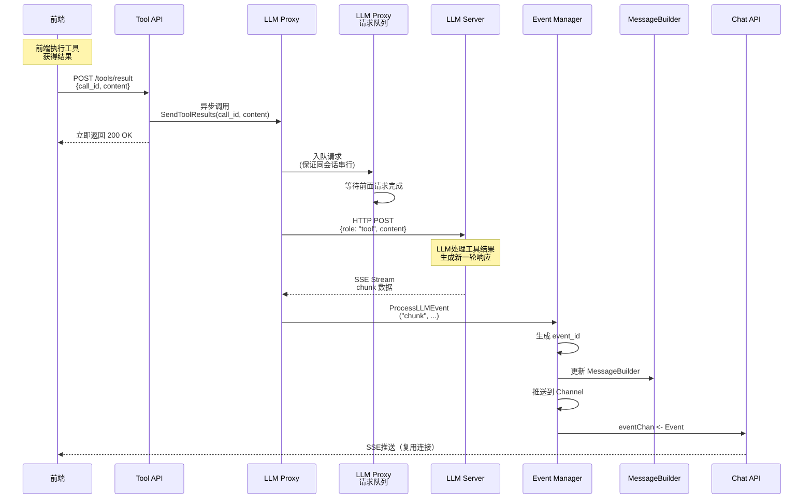

```mermaid
sequenceDiagram
    participant FE as 前端
    participant ToolAPI as Tool API
    participant LLMProxy as LLM Proxy
    participant Queue as LLM Proxy<br/>请求队列
    participant LLMServer as LLM Server
    participant EventMgr as Event Manager
    participant Builder as MessageBuilder
    participant ChatAPI as Chat API

    Note over FE: 前端执行工具<br/>获得结果

    FE->>ToolAPI: POST /tools/result<br/>{call_id, content}
    
    ToolAPI->>LLMProxy: 异步调用<br/>SendToolResults(call_id, content)
    ToolAPI-->>FE: 立即返回 200 OK
    
    LLMProxy->>Queue: 入队请求<br/>(保证同会话串行)
    Queue->>Queue: 等待前面请求完成
    
    LLMProxy->>LLMServer: HTTP POST<br/>{role: "tool", content}
    
    Note over LLMServer: LLM处理工具结果<br/>生成新一轮响应
    
    LLMServer-->>LLMProxy: SSE Stream<br/>chunk 数据
    
    LLMProxy->>EventMgr: ProcessLLMEvent<br/>("chunk", ...)
    
    EventMgr->>EventMgr: 生成 event_id
    EventMgr->>Builder: 更新 MessageBuilder
    EventMgr->>EventMgr: 推送到 Channel
    
    EventMgr->>ChatAPI: eventChan <- Event
    ChatAPI-->>FE: SSE推送（复用连接）
```