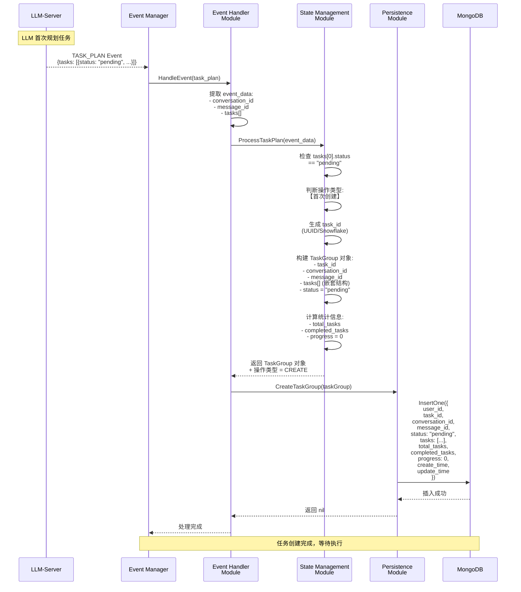

```mermaid
sequenceDiagram
    participant LLM as LLM-Server
    participant EM as Event Manager
    participant EH as Event Handler<br/>Module
    participant SM as State Management<br/>Module
    participant PM as Persistence<br/>Module
    participant DB as MongoDB
    
    Note over LLM: LLM 首次规划任务
    
    LLM-->>EM: TASK_PLAN Event<br/>{tasks: [{status: "pending", ...}]}
    
    EM->>EH: HandleEvent(task_plan)
    
    EH->>EH: 提取 event_data:<br/>- conversation_id<br/>- message_id<br/>- tasks[]
    
    EH->>SM: ProcessTaskPlan(event_data)
    
    SM->>SM: 检查 tasks[0].status<br/>== "pending"
    
    SM->>SM: 判断操作类型:<br/>【首次创建】
    
    SM->>SM: 生成 task_id<br/>(UUID/Snowflake)
    
    SM->>SM: 构建 TaskGroup 对象:<br/>- task_id<br/>- conversation_id<br/>- message_id<br/>- tasks[] (嵌套结构)<br/>- status = "pending"
    
    SM->>SM: 计算统计信息:<br/>- total_tasks<br/>- completed_tasks<br/>- progress = 0
    
    SM-->>EH: 返回 TaskGroup 对象<br/>+ 操作类型 = CREATE
    
    EH->>PM: CreateTaskGroup(taskGroup)
    
    PM->>DB: InsertOne({<br/>  user_id,<br/>  task_id,<br/>  conversation_id,<br/>  message_id,<br/>  status: "pending",<br/>  tasks: [...],<br/>  total_tasks,<br/>  completed_tasks,<br/>  progress: 0,<br/>  create_time,<br/>  update_time<br/>})
    
    DB-->>PM: 插入成功
    
    PM-->>EH: 返回 nil
    
    EH-->>EM: 处理完成
    
    Note over EM,DB: 任务创建完成，等待执行
```