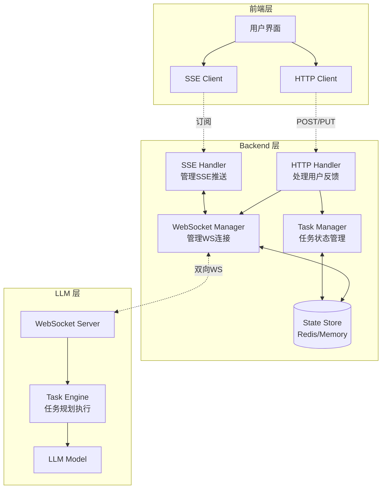

```mermaid
graph TB
    subgraph "前端层"
        UI[用户界面]
        SSE[SSE Client]
        HTTP[HTTP Client]
    end
    
    subgraph "Backend 层"
        direction TB
        SSE_H[SSE Handler<br/>管理SSE推送]
        HTTP_H[HTTP Handler<br/>处理用户反馈]
        WS_M[WebSocket Manager<br/>管理WS连接]
        Task_M[Task Manager<br/>任务状态管理]
        Store[(State Store<br/>Redis/Memory)]
    end
    
    subgraph "LLM 层"
        WS_S[WebSocket Server]
        Task_E[Task Engine<br/>任务规划执行]
        Model[LLM Model]
    end
    
    UI --> SSE
    UI --> HTTP
    
    SSE -.订阅.-> SSE_H
    HTTP -.POST/PUT.-> HTTP_H
    
    SSE_H <--> WS_M
    HTTP_H --> WS_M
    HTTP_H --> Task_M
    
    Task_M <--> Store
    WS_M <--> Store
    
    WS_M <-.双向WS.-> WS_S
    WS_S --> Task_E
    Task_E --> Model
```