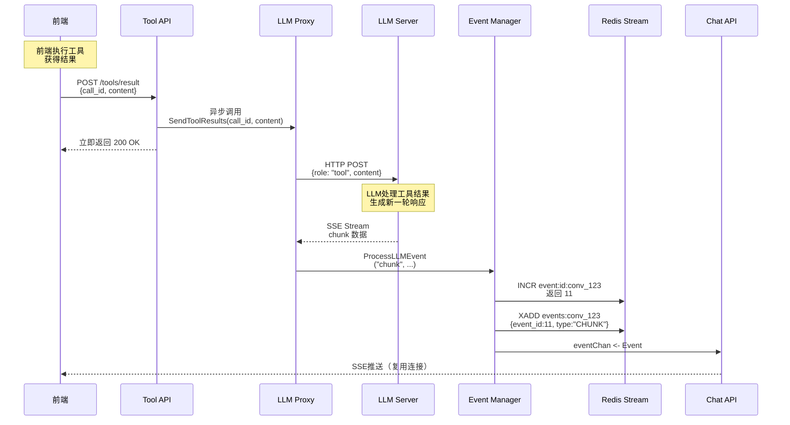

```mermaid
sequenceDiagram
    participant FE as 前端
    participant ToolAPI as Tool API
    participant LLMProxy as LLM Proxy
    participant LLMServer as LLM Server
    participant EventMgr as Event Manager
    participant Redis as Redis Stream
    participant ChatAPI as Chat API

    Note over FE: 前端执行工具<br/>获得结果

    FE->>ToolAPI: POST /tools/result<br/>{call_id, content}
    
    ToolAPI->>LLMProxy: 异步调用<br/>SendToolResults(call_id, content)
    ToolAPI-->>FE: 立即返回 200 OK
    
    LLMProxy->>LLMServer: HTTP POST<br/>{role: "tool", content}
    
    Note over LLMServer: LLM处理工具结果<br/>生成新一轮响应
    
    LLMServer-->>LLMProxy: SSE Stream<br/>chunk 数据
    
    LLMProxy->>EventMgr: ProcessLLMEvent<br/>("chunk", ...)
    EventMgr->>Redis: INCR event:id:conv_123<br/>返回 11
    EventMgr->>Redis: XADD events:conv_123<br/>{event_id:11, type:"CHUNK"}
    
    EventMgr->>ChatAPI: eventChan <- Event
    ChatAPI-->>FE: SSE推送（复用连接）
```