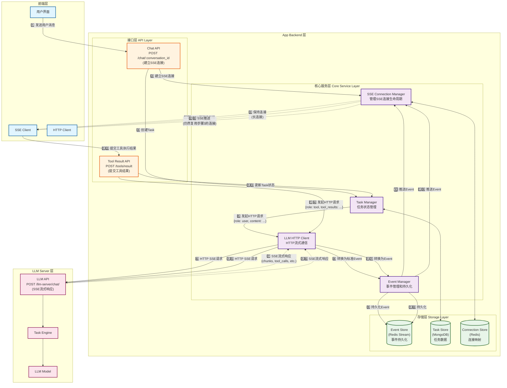

```mermaid
graph TB
    subgraph "前端层"
        UI[用户界面]
        SSE_Client[SSE Client]
        HTTP_Client[HTTP Client]
    end

    subgraph "App Backend 层"
        direction TB
        
        subgraph "接口层 API Layer"
            Chat_API["Chat API<br/>POST /chat/:conversation_id<br/>(建立SSE连接)"]
            Tool_API["Tool Result API<br/>POST /tools/result<br/>(提交工具结果)"]
        end
        
        subgraph "核心服务层 Core Service Layer"
            SSE_Mgr[SSE Connection Manager<br/>管理SSE连接生命周期]
            Event_Mgr[Event Manager<br/>事件管理和持久化]
            Task_Mgr[Task Manager<br/>任务状态管理]
            LLM_Client[LLM HTTP Client<br/>HTTP流式通信]
        end
        
        subgraph "存储层 Storage Layer"
            Event_Store[("Event Store<br/>(Redis Stream)<br/>事件持久化")]
            Task_Store[("Task Store<br/>(MongoDB)<br/>任务数据")]
            Conn_Store[("Connection Store<br/>(Redis)<br/>连接映射")]
        end
    end

    subgraph "LLM Server 层"
        LLM_API["LLM API<br/>POST /llm-server/chat/<br/>(SSE流式响应)"]
        Task_Engine[Task Engine]
        Model[LLM Model]
    end

    %% 前端发送消息流程
    UI -->|"1️⃣ 发送用户消息"| Chat_API
    Chat_API -->|"2️⃣ 建立SSE连接"| SSE_Mgr
    SSE_Mgr -.->|"3️⃣ 保持连接<br/>(长连接)"| SSE_Client
    
    Chat_API -->|"4️⃣ 创建Task"| Task_Mgr
    Task_Mgr -->|"5️⃣ 发起HTTP请求<br/>{role: user, content: ...}"| LLM_Client
    
    %% LLM响应流程
    LLM_Client -->|"6️⃣ HTTP SSE请求"| LLM_API
    LLM_API -.->|"7️⃣ SSE流式响应<br/>(chunks, tool_calls, etc.)"| LLM_Client
    
    LLM_Client -->|"8️⃣ 转换为标准Event"| Event_Mgr
    Event_Mgr -->|"9️⃣ 持久化Event"| Event_Store
    Event_Mgr -->|"🔟 推送Event"| SSE_Mgr
    SSE_Mgr -.->|"1️⃣1️⃣ SSE推送给前端<br/>(复用步骤3的连接)"| SSE_Client
    
    %% 工具调用流程
    SSE_Client -->|"1️⃣2️⃣ 提交工具执行结果"| Tool_API
    Tool_API -->|"1️⃣3️⃣ 更新Task状态"| Task_Mgr
    Tool_API -->|"1️⃣4️⃣ 发起HTTP请求<br/>{role: tool, tool_results: ...}"| LLM_Client
    
    %% 第二轮LLM响应（复用连接）
    LLM_Client -->|"1️⃣5️⃣ HTTP SSE请求"| LLM_API
    LLM_API -.->|"1️⃣6️⃣ SSE流式响应"| LLM_Client
    LLM_Client -->|"1️⃣7️⃣ 转换为Event"| Event_Mgr
    Event_Mgr -->|"1️⃣8️⃣ 持久化"| Event_Store
    Event_Mgr -->|"1️⃣9️⃣ 推送Event"| SSE_Mgr
    SSE_Mgr -.->|"2️⃣0️⃣ SSE推送<br/>(仍然复用步骤3的连接)"| SSE_Client
    
    %% 内部依赖
    Task_Mgr <--> Task_Store
    SSE_Mgr <--> Conn_Store
    
    LLM_API --> Task_Engine
    Task_Engine --> Model
    
    %% 样式
    classDef frontend fill:#e1f5ff,stroke:#01579b,stroke-width:2px
    classDef api fill:#fff3e0,stroke:#e65100,stroke-width:2px
    classDef service fill:#f3e5f5,stroke:#4a148c,stroke-width:2px
    classDef storage fill:#e8f5e9,stroke:#1b5e20,stroke-width:2px
    classDef llm fill:#fce4ec,stroke:#880e4f,stroke-width:2px
    
    class UI,SSE_Client,HTTP_Client frontend
    class Chat_API,Tool_API api
    class SSE_Mgr,Event_Mgr,Task_Mgr,LLM_Client service
    class Event_Store,Task_Store,Conn_Store storage
    class LLM_API,Task_Engine,Model llm
```