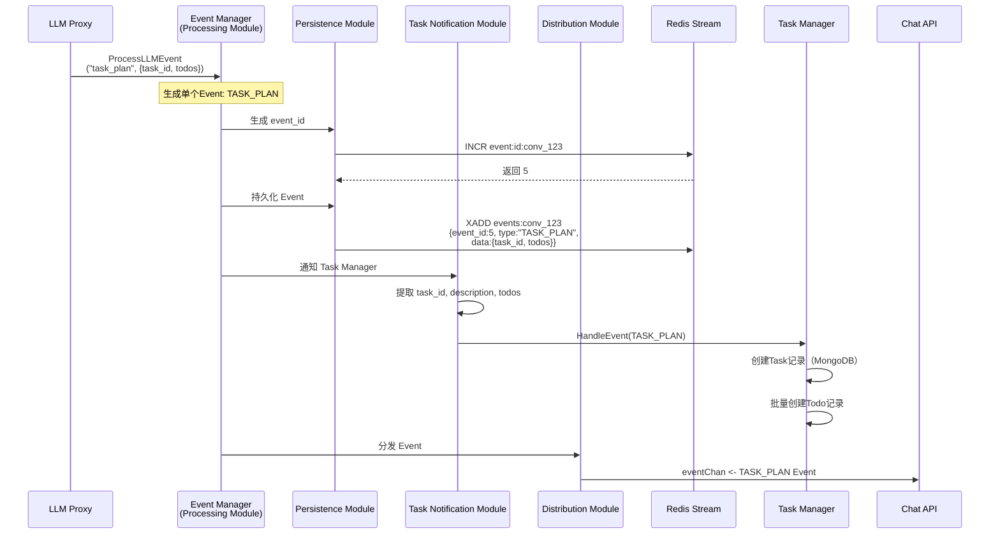

```mermaid
sequenceDiagram
    participant LLMProxy as LLM Proxy
    participant EventProc as Event Manager<br/>(Processing Module)
    participant Persist as Persistence Module
    participant TaskNotif as Task Notification Module
    participant Distrib as Distribution Module
    participant Redis as Redis Stream
    participant TaskMgr as Task Manager
    participant ChatAPI as Chat API

    LLMProxy->>EventProc: ProcessLLMEvent<br/>("task_plan", {task_id, todos})

    Note over EventProc: 生成单个Event: TASK_PLAN
    
    EventProc->>Persist: 生成 event_id
    Persist->>Redis: INCR event:id:conv_123
    Redis-->>Persist: 返回 5
    
    EventProc->>Persist: 持久化 Event
    Persist->>Redis: XADD events:conv_123<br/>{event_id:5, type:"TASK_PLAN",<br/>data:{task_id, todos}}
    
    EventProc->>TaskNotif: 通知 Task Manager
    TaskNotif->>TaskNotif: 提取 task_id, description, todos
    TaskNotif->>TaskMgr: HandleEvent(TASK_PLAN)
    TaskMgr->>TaskMgr: 创建Task记录（MongoDB）
    TaskMgr->>TaskMgr: 批量创建Todo记录
    
    EventProc->>Distrib: 分发 Event
    Distrib->>ChatAPI: eventChan <- TASK_PLAN Event
```