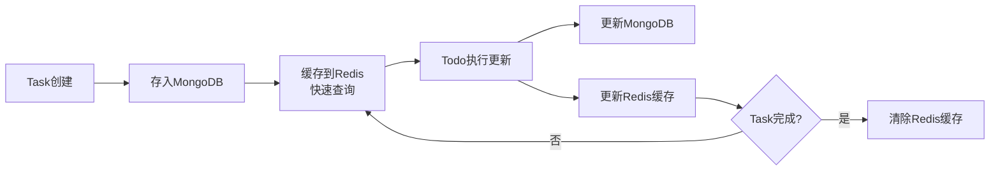

**存储结构**：
```
Redis Key: task:{task_id}
Value: {
  status: "EXECUTING",
  current_todo_index: 2,
  wait_point: {
    wait_id: "wait_xxx",
    type: "SIGN_TX",
    todo_id: "todo_2",
    created_at: timestamp
  }
}
TTL: 1800s
```