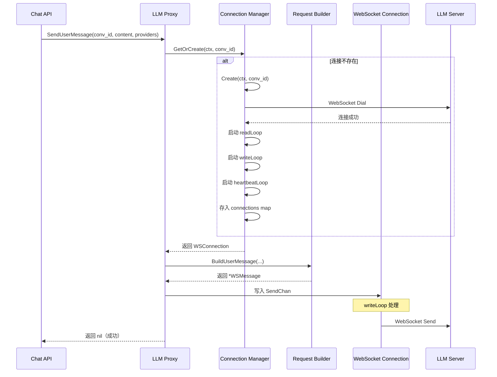

```mermaid
sequenceDiagram
    participant ChatAPI as Chat API
    participant LLMProxy as LLM Proxy
    participant ConnMgr as Connection Manager
    participant ReqBuilder as Request Builder
    participant WSConn as WebSocket Connection
    participant LLMServer as LLM Server

    ChatAPI->>LLMProxy: SendUserMessage(conv_id, content, providers)
    
    LLMProxy->>ConnMgr: GetOrCreate(ctx, conv_id)
    
    alt 连接不存在
        ConnMgr->>ConnMgr: Create(ctx, conv_id)
        ConnMgr->>LLMServer: WebSocket Dial
        LLMServer-->>ConnMgr: 连接成功
        ConnMgr->>ConnMgr: 启动 readLoop
        ConnMgr->>ConnMgr: 启动 writeLoop
        ConnMgr->>ConnMgr: 启动 heartbeatLoop
        ConnMgr->>ConnMgr: 存入 connections map
    end
    
    ConnMgr-->>LLMProxy: 返回 WSConnection
    
    LLMProxy->>ReqBuilder: BuildUserMessage(...)
    ReqBuilder-->>LLMProxy: 返回 *WSMessage
    
    LLMProxy->>WSConn: 写入 SendChan
    
    Note over WSConn: writeLoop 处理
    WSConn->>LLMServer: WebSocket Send
    
    LLMProxy-->>ChatAPI: 返回 nil（成功）
```