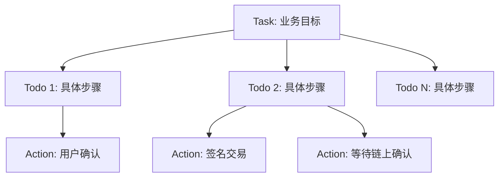

```mermaid
graph TB
    A[Task: 业务目标] --> B[Todo 1: 具体步骤]
    A --> C[Todo 2: 具体步骤]
    A --> D[Todo N: 具体步骤]
    
    B --> B1[Action: 用户确认]
    C --> C1[Action: 签名交易]
    C --> C2[Action: 等待链上确认]
```