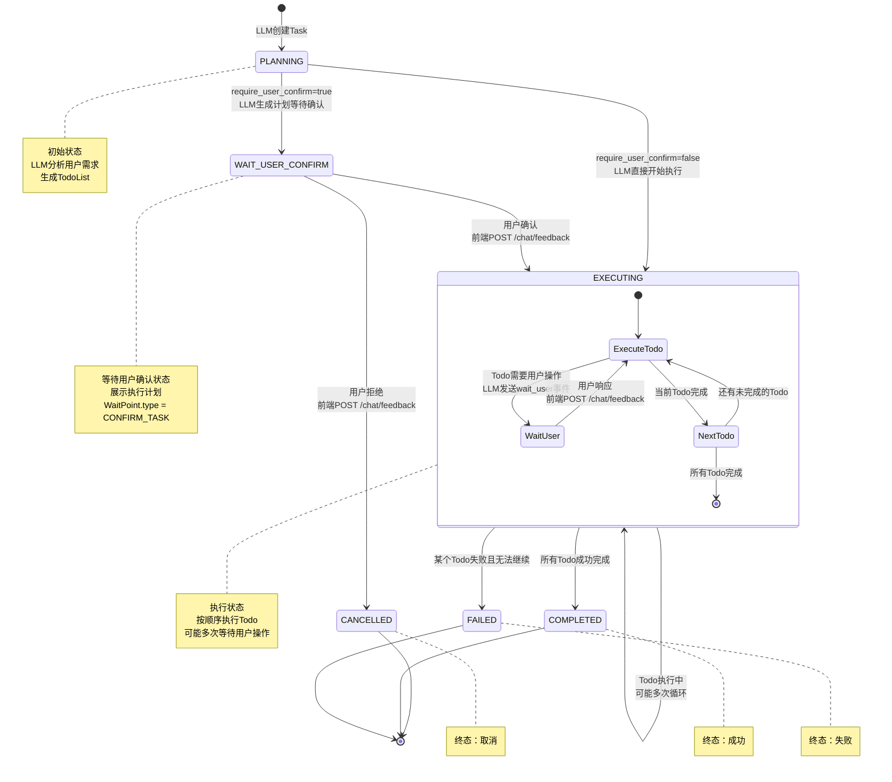

```mermaid
stateDiagram-v2
    [*] --> PLANNING: LLM创建Task
    
    PLANNING --> WAIT_USER_CONFIRM: require_user_confirm=true<br/>LLM生成计划等待确认
    PLANNING --> EXECUTING: require_user_confirm=false<br/>LLM直接开始执行
    
    WAIT_USER_CONFIRM --> EXECUTING: 用户确认<br/>前端POST /chat/feedback
    WAIT_USER_CONFIRM --> CANCELLED: 用户拒绝<br/>前端POST /chat/feedback
    
    EXECUTING --> EXECUTING: Todo执行中<br/>可能多次循环
    
    state EXECUTING {
        [*] --> ExecuteTodo
        ExecuteTodo --> WaitUser: Todo需要用户操作<br/>LLM发送wait_user事件
        WaitUser --> ExecuteTodo: 用户响应<br/>前端POST /chat/feedback
        ExecuteTodo --> NextTodo: 当前Todo完成
        NextTodo --> ExecuteTodo: 还有未完成的Todo
        NextTodo --> [*]: 所有Todo完成
    }
    
    EXECUTING --> COMPLETED: 所有Todo成功完成
    EXECUTING --> FAILED: 某个Todo失败且无法继续
    
    CANCELLED --> [*]
    COMPLETED --> [*]
    FAILED --> [*]
    
    note right of PLANNING
        初始状态
        LLM分析用户需求
        生成TodoList
    end note
    
    note right of WAIT_USER_CONFIRM
        等待用户确认状态
        展示执行计划
        WaitPoint.type = CONFIRM_TASK
    end note
    
    note right of EXECUTING
        执行状态
        按顺序执行Todo
        可能多次等待用户操作
    end note
    
    note right of COMPLETED
        终态：成功
    end note
    
    note right of FAILED
        终态：失败
    end note
    
    note right of CANCELLED
        终态：取消
    end note
```