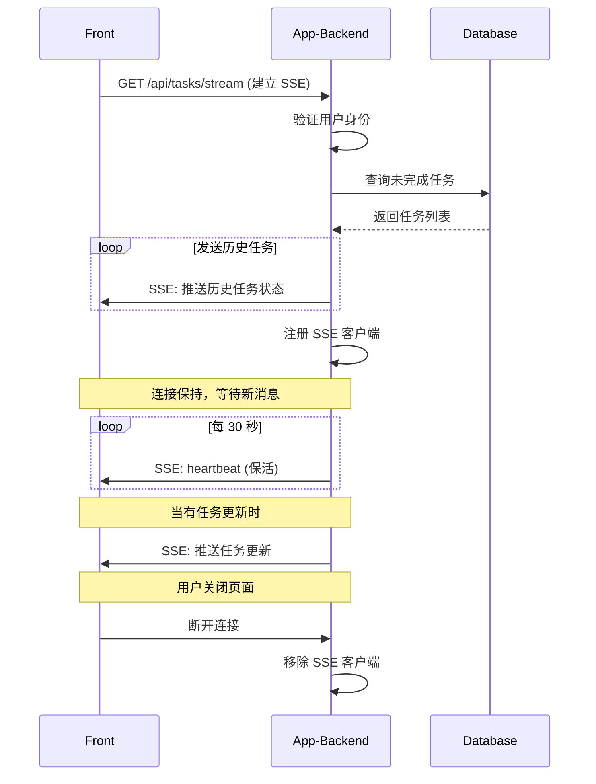

```mermaid
sequenceDiagram
    participant F as Front
    participant A as App-Backend
    participant D as Database
    
    F->>A: GET /api/tasks/stream (建立 SSE)
    A->>A: 验证用户身份
    A->>D: 查询未完成任务
    D-->>A: 返回任务列表
    
    loop 发送历史任务
        A->>F: SSE: 推送历史任务状态
    end
    
    A->>A: 注册 SSE 客户端
    
    Note over F,A: 连接保持，等待新消息
    
    loop 每 30 秒
        A->>F: SSE: heartbeat (保活)
    end
    
    Note over F,A: 当有任务更新时
    A->>F: SSE: 推送任务更新
    
    Note over F,A: 用户关闭页面
    F->>A: 断开连接
    A->>A: 移除 SSE 客户端
```