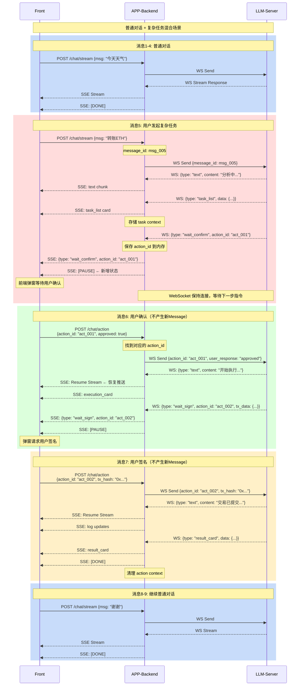

```mermaid
sequenceDiagram
    participant F as Front
    participant AB as APP-Backend
    participant LLM as LLM-Server
    
    Note over F,LLM: 普通对话 + 复杂任务混合场景
    
    rect rgb(200, 220, 250)
    Note over F,LLM: 消息1-4: 普通对话
    F->>AB: POST /chat/stream {msg: "今天天气"}
    AB->>LLM: WS Send
    LLM-->>AB: WS Stream Response
    AB-->>F: SSE Stream
    AB-->>F: SSE: [DONE]
    end
    
    rect rgb(255, 220, 220)
    Note over F,LLM: 消息5: 用户发起复杂任务
    F->>AB: POST /chat/stream {msg: "转账ETH"}
    Note over AB: message_id: msg_005
    AB->>LLM: WS Send {message_id: msg_005}
    
    LLM-->>AB: WS: {type: "text", content: "分析中..."}
    AB-->>F: SSE: text chunk
    
    LLM-->>AB: WS: {type: "task_list", data: {...}}
    AB-->>F: SSE: task_list card
    Note over AB: 存储 task context
    
    LLM-->>AB: WS: {type: "wait_confirm", action_id: "act_001"}
    Note over AB: 保存 action_id 到内存
    AB-->>F: SSE: {type: "wait_confirm", action_id: "act_001"}
    AB-->>F: SSE: [PAUSE] ← 新增状态
    Note over F: 前端弹窗等待用户确认
    Note over AB,LLM: WebSocket 保持连接，等待下一步指令
    end
    
    rect rgb(220, 255, 220)
    Note over F,LLM: 消息6: 用户确认（不产生新Message）
    F->>AB: POST /chat/action<br/>{action_id: "act_001", approved: true}
    Note over AB: 找到对应的 action_id
    AB->>LLM: WS Send {action_id: "act_001", user_response: "approved"}
    
    LLM-->>AB: WS: {type: "text", content: "开始执行..."}
    AB-->>F: SSE: Resume Stream ← 恢复推送
    AB-->>F: SSE: execution_card
    
    LLM-->>AB: WS: {type: "wait_sign", action_id: "act_002", tx_data: {...}}
    AB-->>F: SSE: {type: "wait_sign", action_id: "act_002"}
    AB-->>F: SSE: [PAUSE]
    Note over F: 弹窗请求用户签名
    end
    
    rect rgb(255, 240, 200)
    Note over F,LLM: 消息7: 用户签名（不产生新Message）
    F->>AB: POST /chat/action<br/>{action_id: "act_002", tx_hash: "0x..."}
    AB->>LLM: WS Send {action_id: "act_002", tx_hash: "0x..."}
    
    LLM-->>AB: WS: {type: "text", content: "交易已提交..."}
    AB-->>F: SSE: Resume Stream
    AB-->>F: SSE: log updates
    
    LLM-->>AB: WS: {type: "result_card", data: {...}}
    AB-->>F: SSE: result_card
    AB-->>F: SSE: [DONE]
    Note over AB: 清理 action context
    end
    
    rect rgb(200, 220, 250)
    Note over F,LLM: 消息8-9: 继续普通对话
    F->>AB: POST /chat/stream {msg: "谢谢"}
    AB->>LLM: WS Send
    LLM-->>AB: WS Stream
    AB-->>F: SSE Stream
    AB-->>F: SSE: [DONE]
    end
```