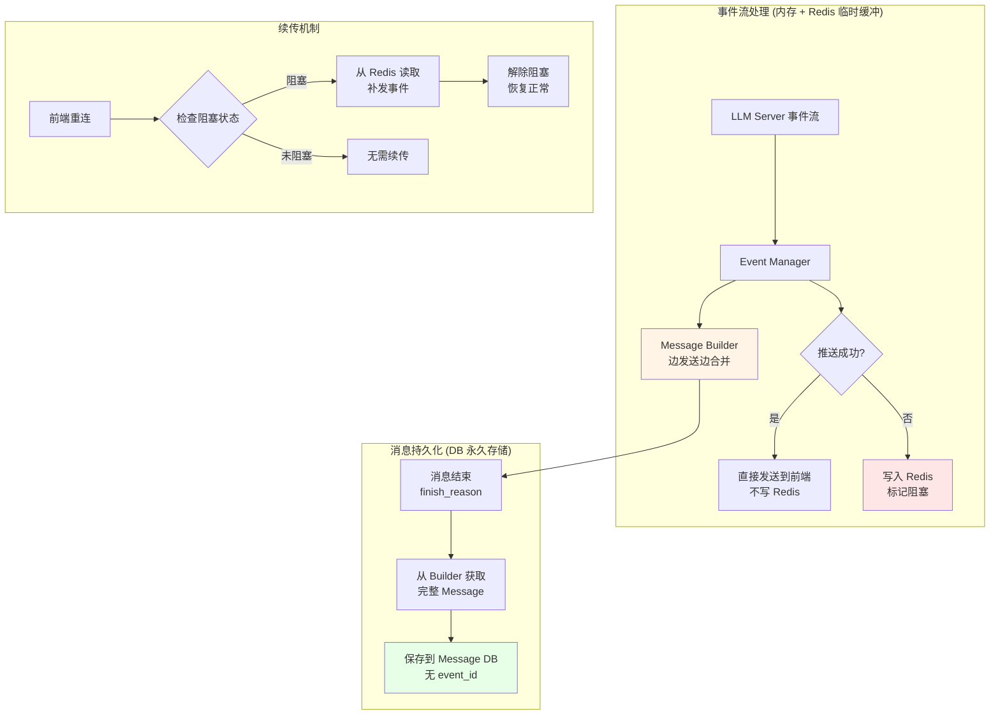

```mermaid
graph TB
    subgraph "事件流处理 (内存 + Redis 临时缓冲)"
        LLM[LLM Server 事件流]
        EventMgr[Event Manager]
        Builder[Message Builder<br/>边发送边合并]
        
        LLM --> EventMgr
        EventMgr --> Builder
        
        EventMgr --> Normal{推送成功?}
        Normal -->|是| Direct[直接发送到前端<br/>不写 Redis]
        Normal -->|否| ToRedis[写入 Redis<br/>标记阻塞]
    end
    
    subgraph "续传机制"
        Reconnect[前端重连]
        CheckBlock{检查阻塞状态}
        
        Reconnect --> CheckBlock
        CheckBlock -->|阻塞| FromRedis[从 Redis 读取<br/>补发事件]
        CheckBlock -->|未阻塞| NoReplay[无需续传]
        
        FromRedis --> Unblock[解除阻塞<br/>恢复正常]
    end
    
    subgraph "消息持久化 (DB 永久存储)"
        Finish[消息结束<br/>finish_reason]
        GetMsg[从 Builder 获取<br/>完整 Message]
        SaveDB[保存到 Message DB<br/>无 event_id]
        
        Builder --> Finish
        Finish --> GetMsg
        GetMsg --> SaveDB
    end
    
    style Builder fill:#fff4e6
    style ToRedis fill:#ffe6e6
    style SaveDB fill:#e6ffe6
```