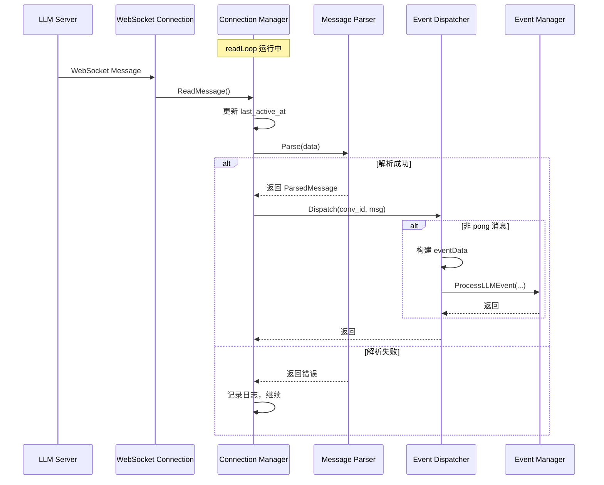

```mermaid
sequenceDiagram
    participant LLMServer as LLM Server
    participant WSConn as WebSocket Connection
    participant ConnMgr as Connection Manager
    participant MsgParser as Message Parser
    participant Dispatcher as Event Dispatcher
    participant EventMgr as Event Manager

    Note over ConnMgr: readLoop 运行中

    LLMServer->>WSConn: WebSocket Message
    WSConn->>ConnMgr: ReadMessage()
    
    ConnMgr->>ConnMgr: 更新 last_active_at
    
    ConnMgr->>MsgParser: Parse(data)
    
    alt 解析成功
        MsgParser-->>ConnMgr: 返回 ParsedMessage
        ConnMgr->>Dispatcher: Dispatch(conv_id, msg)
        
        alt 非 pong 消息
            Dispatcher->>Dispatcher: 构建 eventData
            Dispatcher->>EventMgr: ProcessLLMEvent(...)
            EventMgr-->>Dispatcher: 返回
        end
        
        Dispatcher-->>ConnMgr: 返回
    else 解析失败
        MsgParser-->>ConnMgr: 返回错误
        ConnMgr->>ConnMgr: 记录日志，继续
    end
```