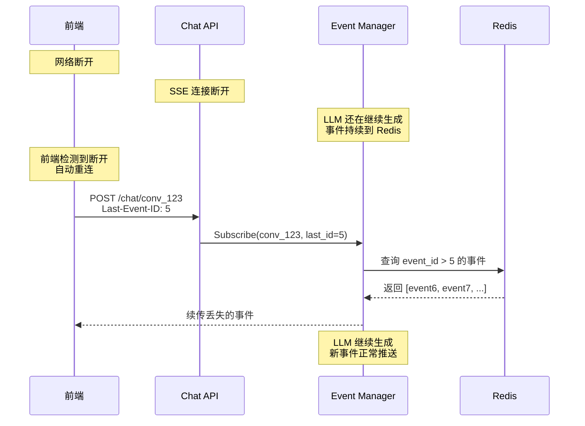

```mermaid
sequenceDiagram
    participant FE as 前端
    participant API as Chat API
    participant EM as Event Manager
    participant Redis as Redis
    
    Note over FE: 网络断开
    Note over API: SSE 连接断开
    Note over EM: LLM 还在继续生成<br/>事件持续到 Redis
    
    Note over FE: 前端检测到断开<br/>自动重连
    
    FE->>API: POST /chat/conv_123<br/>Last-Event-ID: 5
    
    API->>EM: Subscribe(conv_123, last_id=5)
    EM->>Redis: 查询 event_id > 5 的事件
    Redis-->>EM: 返回 [event6, event7, ...]
    
    EM-->>FE: 续传丢失的事件
    
    Note over EM: LLM 继续生成<br/>新事件正常推送
```