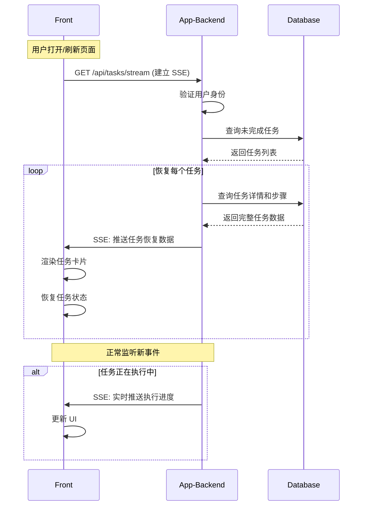

```mermaid
sequenceDiagram
    participant F as Front
    participant A as App-Backend
    participant D as Database
    
    Note over F: 用户打开/刷新页面
    
    F->>A: GET /api/tasks/stream (建立 SSE)
    A->>A: 验证用户身份
    A->>D: 查询未完成任务
    D-->>A: 返回任务列表
    
    loop 恢复每个任务
        A->>D: 查询任务详情和步骤
        D-->>A: 返回完整任务数据
        A->>F: SSE: 推送任务恢复数据
        F->>F: 渲染任务卡片
        F->>F: 恢复任务状态
    end
    
    Note over F,A: 正常监听新事件
    
    alt 任务正在执行中
        A->>F: SSE: 实时推送执行进度
        F->>F: 更新 UI
    end
```