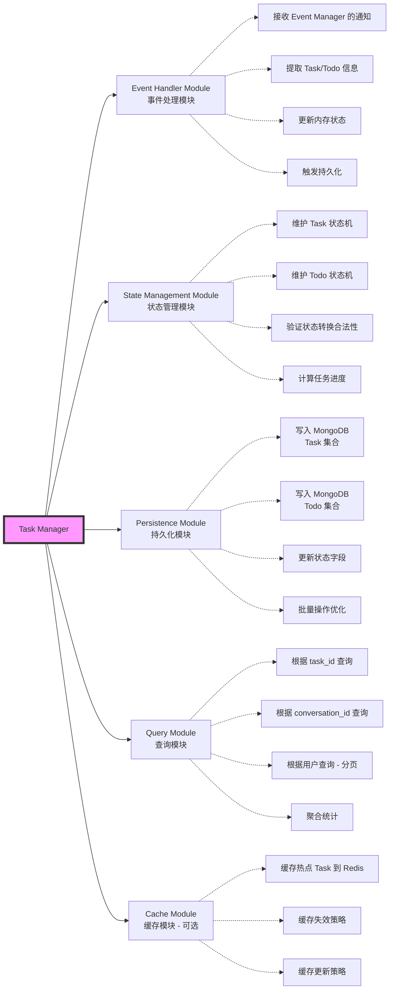

```mermaid
graph LR
    TM[Task Manager]
    
    TM --> EHM[Event Handler Module<br/>事件处理模块]
    TM --> SMM[State Management Module<br/>状态管理模块]
    TM --> PM[Persistence Module<br/>持久化模块]
    TM --> QM[Query Module<br/>查询模块]
    TM --> CM[Cache Module<br/>缓存模块 - 可选]
    
    EHM -.-> EHM1[接收 Event Manager 的通知]
    EHM -.-> EHM2[提取 Task/Todo 信息]
    EHM -.-> EHM3[更新内存状态]
    EHM -.-> EHM4[触发持久化]
    
    SMM -.-> SMM1[维护 Task 状态机]
    SMM -.-> SMM2[维护 Todo 状态机]
    SMM -.-> SMM3[验证状态转换合法性]
    SMM -.-> SMM4[计算任务进度]
    
    PM -.-> PM1[写入 MongoDB<br/>Task 集合]
    PM -.-> PM2[写入 MongoDB<br/>Todo 集合]
    PM -.-> PM3[更新状态字段]
    PM -.-> PM4[批量操作优化]
    
    QM -.-> QM1[根据 task_id 查询]
    QM -.-> QM2[根据 conversation_id 查询]
    QM -.-> QM3[根据用户查询 - 分页]
    QM -.-> QM4[聚合统计]
    
    CM -.-> CM1[缓存热点 Task 到 Redis]
    CM -.-> CM2[缓存失效策略]
    CM -.-> CM3[缓存更新策略]
    
    style TM fill:#f9f,stroke:#333,stroke-width:4px
```