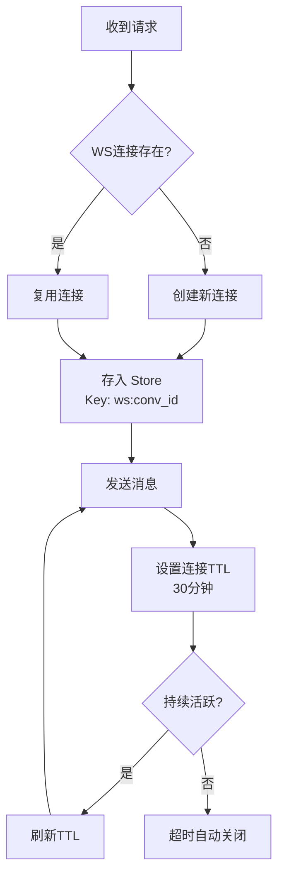

```mermaid
graph TD
    A[收到请求] --> B{WS连接存在?}
    B -->|否| C[创建新连接]
    B -->|是| D[复用连接]
    
    C --> E[存入 Store<br/>Key: ws:conv_id]
    D --> E
    
    E --> F[发送消息]
    
    F --> G[设置连接TTL<br/>30分钟]
    
    G --> H{持续活跃?}
    H -->|是| I[刷新TTL]
    H -->|否| J[超时自动关闭]
    
    I --> F
```