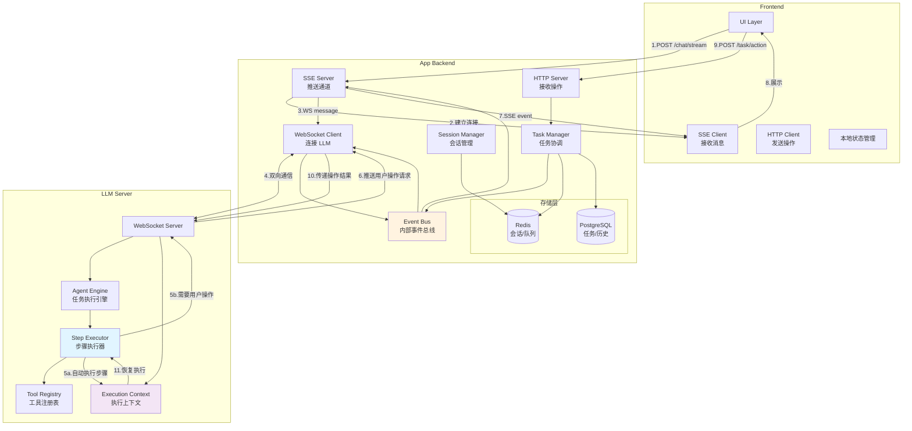

```mermaid
graph TB
    subgraph Frontend["Frontend"]
        UI[UI Layer]
        SSE_C[SSE Client<br/>接收消息]
        HTTP_C[HTTP Client<br/>发送操作]
        LocalState[本地状态管理]
    end

    subgraph AppBackend["App Backend"]
        SSE_S[SSE Server<br/>推送通道]
        HTTP_S[HTTP Server<br/>接收操作]
        WS_Client[WebSocket Client<br/>连接 LLM]
        
        SessionMgr[Session Manager<br/>会话管理]
        TaskMgr[Task Manager<br/>任务协调]
        EventBus[Event Bus<br/>内部事件总线]
        
        subgraph Storage["存储层"]
            Redis[(Redis<br/>会话/队列)]
            DB[(PostgreSQL<br/>任务/历史)]
        end
    end

    subgraph LLMServer["LLM Server"]
        WS_Server[WebSocket Server]
        AgentEngine[Agent Engine<br/>任务执行引擎]
        StepExecutor[Step Executor<br/>步骤执行器]
        ToolRegistry[Tool Registry<br/>工具注册表]
        ExecutionCtx[Execution Context<br/>执行上下文]
    end

    UI -->|1.POST /chat/stream| SSE_S
    SSE_S -->|2.建立连接| SSE_C
    SSE_S -->|3.WS message| WS_Client
    WS_Client <-->|4.双向通信| WS_Server
    
    WS_Server --> AgentEngine
    AgentEngine --> StepExecutor
    StepExecutor --> ToolRegistry
    
    StepExecutor -->|5a.自动执行步骤| ExecutionCtx
    StepExecutor -->|5b.需要用户操作| WS_Server
    WS_Server -->|6.推送用户操作请求| WS_Client
    WS_Client --> EventBus
    EventBus --> SSE_S
    SSE_S -->|7.SSE event| SSE_C
    SSE_C -->|8.展示| UI
    
    UI -->|9.POST /task/action| HTTP_S
    HTTP_S --> TaskMgr
    TaskMgr --> EventBus
    EventBus --> WS_Client
    WS_Client -->|10.传递操作结果| WS_Server
    WS_Server --> ExecutionCtx
    ExecutionCtx -->|11.恢复执行| StepExecutor
    
    SessionMgr --> Redis
    TaskMgr --> Redis
    TaskMgr --> DB
    
    style StepExecutor fill:#e1f5ff
    style EventBus fill:#fff3e0
    style ExecutionCtx fill:#f3e5f5
```