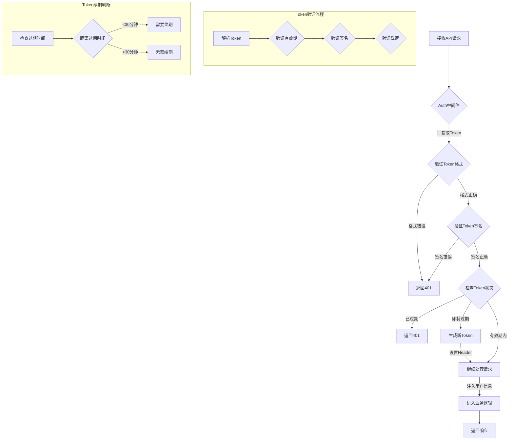

```mermaid
flowchart TD
    A[接收API请求] --> B{Auth中间件}
    
    B -->|1. 提取Token| C{验证Token格式}
    C -->|格式错误| D[返回401]
    
    C -->|格式正确| E{验证Token签名}
    E -->|签名错误| D
    
    E -->|签名正确| F{检查Token状态}
    
    F -->|已过期| G[返回401]
    
    F -->|即将过期| H[生成新Token]
    H -->|设置Header| I[继续处理请求]
    
    F -->|有效期内| I
    
    I -->|注入用户信息| J[进入业务逻辑]
    J --> K[返回响应]
    
    %% 子流程：Token验证详情
    subgraph Token验证流程
        L[解析Token] --> M{验证有效期}
        M --> N{验证签名}
        N --> O{验证载荷}
    end
    
    %% 子流程：续期逻辑
    subgraph Token续期判断
        P[检查过期时间] --> Q{距离过期时间}
        Q -->|<30分钟| R[需要续期]
        Q -->|>30分钟| S[无需续期]
    end
```