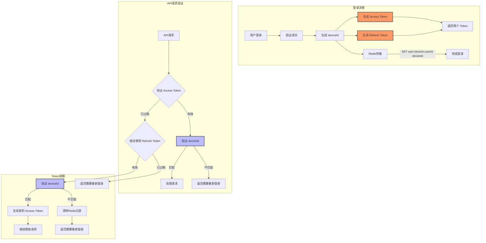

```mermaid
flowchart TD
    subgraph 登录流程
    A[用户登录] --> B[验证成功]
    B --> C[生成 deviceId]
    C --> D[生成 Access Token]
    C --> E[生成 Refresh Token]
    D --> F[返回两个 Token]
    E --> F
    C --> G[Redis存储]
    G -->|SET user:session:userId deviceId| H[完成登录]
    end

    subgraph API请求验证
    I[API请求] --> J{验证 Access Token}
    J -->|有效| K[验证 deviceId]
    K -->|匹配| L[处理请求]
    K -->|不匹配| M[返回需要重新登录]
    J -->|已过期| N{尝试使用 Refresh Token}
    end
    
    subgraph Token续期
    N -->|有效| O[验证 deviceId]
    O -->|匹配| P[生成新的 Access Token]
    P --> Q[继续原始请求]
    O -->|不匹配| R[清除Redis记录]
    R --> S[返回需要重新登录]
    N -->|已过期| T[返回需要重新登录]
    end

    style D fill:#f96,stroke:#333,stroke-width:2px
    style E fill:#f96,stroke:#333,stroke-width:2px
    style K fill:#bbf,stroke:#333,stroke-width:2px
    style O fill:#bbf,stroke:#333,stroke-width:2px
```