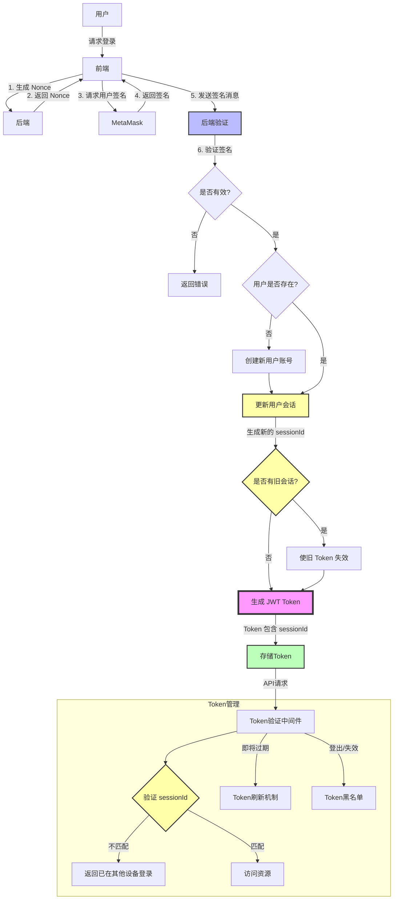

```mermaid
flowchart TD
    A[用户] -->|请求登录| B[前端]
    B -->|1. 生成 Nonce| C[后端]
    C -->|2. 返回 Nonce| B
    B -->|3. 请求用户签名| D[MetaMask]
    D -->|4. 返回签名| B
    B -->|5. 发送签名消息| E[后端验证]
    
    E -->|6. 验证签名| F{是否有效?}
    F -->|否| G[返回错误]
    F -->|是| H{用户是否存在?}
    
    H -->|否| I[创建新用户账号]
    I -->P[更新用户会话]
    H -->|是| P
    
    P -->|生成新的 sessionId| Q{是否有旧会话?}
    Q -->|是| R[使旧 Token 失效]
    Q -->|否| J
    R --> J[生成 JWT Token]
    
    J -->|Token 包含 sessionId| K[存储Token]
    
    subgraph Token管理
        L[Token验证中间件] --> S{验证 sessionId}
        S -->|不匹配| T[返回已在其他设备登录]
        S -->|匹配| O[访问资源]
        L -->|即将过期| M[Token刷新机制]
        L -->|登出/失效| N[Token黑名单]
    end
    
    K -->|API请求| L

    style J fill:#f9f,stroke:#333,stroke-width:4px
    style E fill:#bbf,stroke:#333,stroke-width:2px
    style K fill:#bfb,stroke:#333,stroke-width:2px
    style P fill:#ffa,stroke:#333,stroke-width:2px
    style Q fill:#ffa,stroke:#333,stroke-width:2px
    style S fill:#ffa,stroke:#333,stroke-width:2px
```