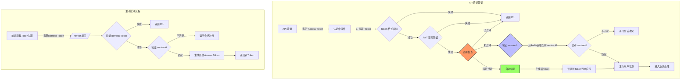

```mermaid
flowchart TD
    subgraph API请求验证
    A[API 请求] -->|携带 Access Token| B[认证中间件]
    B -->|1. 提取 Token| C{Token 格式校验}
    C -->|失败| D[返回401]
    C -->|成功| E{JWT 签名验证}
    E -->|失败| D
    E -->|成功| F{过期检查}
    
    F -->|已过期| D
    F -->|即将过期| G[自动续期]
    F -->|未过期| H{验证 sessionId}
    
    H -->|从Redis获取当前sessionId| I{比对sessionId}
    I -->|不匹配| J[返回会话冲突]
    I -->|匹配| K[注入用户信息]
    K --> L[进入业务处理]
    
    G -->|生成新Token| M[设置新Token到响应头]
    M --> K
    end

    subgraph 主动续期流程
    N[前端发现Token过期] -->|携带Refresh Token| O[/refresh接口/]
    O --> P{验证Refresh Token}
    P -->|失败| Q[返回401]
    P -->|成功| R{验证sessionId}
    R -->|不匹配| S[返回会话冲突]
    R -->|匹配| T[生成新的Access Token]
    T --> U[返回新Token]
    end

    style F fill:#f96,stroke:#333,stroke-width:2px
    style H fill:#bbf,stroke:#333,stroke-width:2px
    style G fill:#9f6,stroke:#333,stroke-width:2px
```