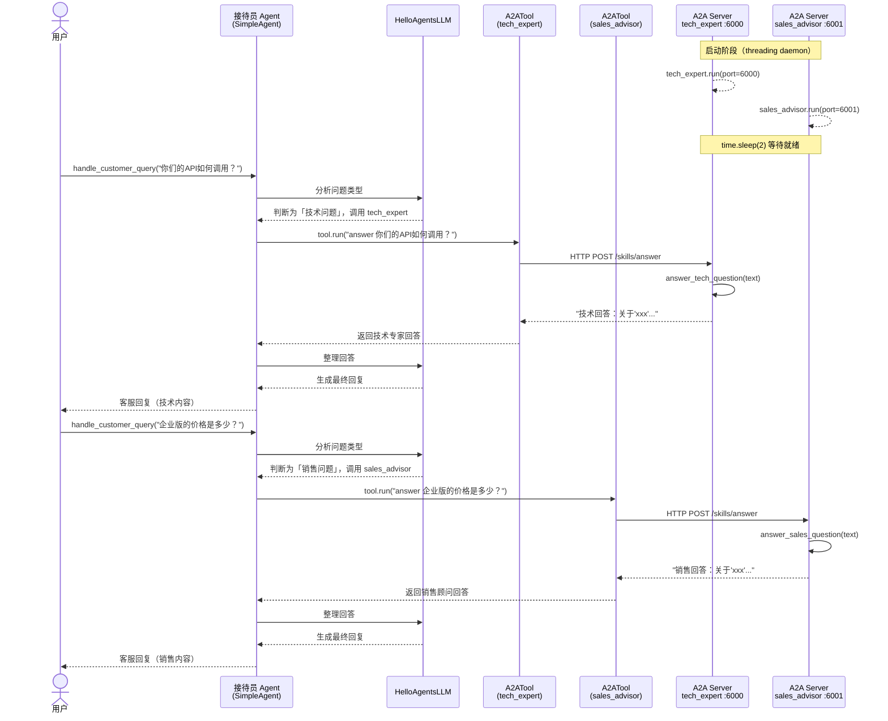

```mermaid
sequenceDiagram
    actor U as 用户
    participant R as 接待员 Agent<br/>(SimpleAgent)
    participant LLM as HelloAgentsLLM
    participant TT as A2ATool<br/>(tech_expert)
    participant ST as A2ATool<br/>(sales_advisor)
    participant TE as A2A Server<br/>tech_expert :6000
    participant SA as A2A Server<br/>sales_advisor :6001

    Note over TE,SA: 启动阶段（threading daemon）
    TE-->>TE: tech_expert.run(port=6000)
    SA-->>SA: sales_advisor.run(port=6001)
    Note over TE,SA: time.sleep(2) 等待就绪

    U->>R: handle_customer_query("你们的API如何调用？")
    R->>LLM: 分析问题类型
    LLM-->>R: 判断为「技术问题」，调用 tech_expert

    R->>TT: tool.run("answer 你们的API如何调用？")
    TT->>TE: HTTP POST /skills/answer
    TE->>TE: answer_tech_question(text)
    TE-->>TT: "技术回答：关于'xxx'..."
    TT-->>R: 返回技术专家回答

    R->>LLM: 整理回答
    LLM-->>R: 生成最终回复
    R-->>U: 客服回复（技术内容）

    U->>R: handle_customer_query("企业版的价格是多少？")
    R->>LLM: 分析问题类型
    LLM-->>R: 判断为「销售问题」，调用 sales_advisor

    R->>ST: tool.run("answer 企业版的价格是多少？")
    ST->>SA: HTTP POST /skills/answer
    SA->>SA: answer_sales_question(text)
    SA-->>ST: "销售回答：关于'xxx'..."
    ST-->>R: 返回销售顾问回答

    R->>LLM: 整理回答
    LLM-->>R: 生成最终回复
    R-->>U: 客服回复（销售内容）
```