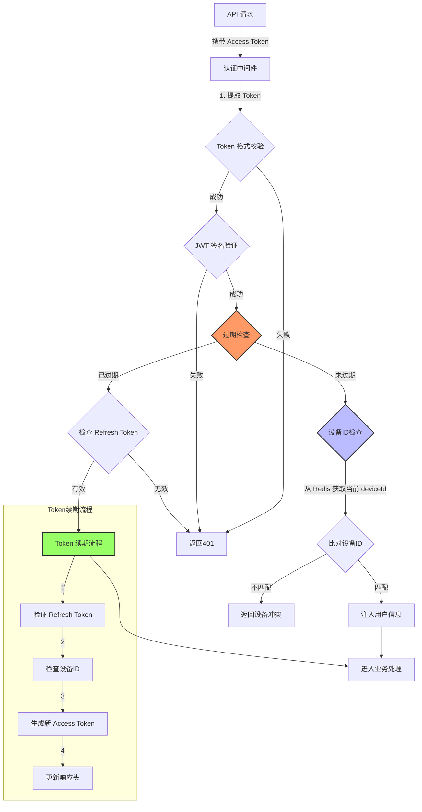

```mermaid
flowchart TD
    A[API 请求] -->|携带 Access Token| B[认证中间件]
    
    B -->|1. 提取 Token| C{Token 格式校验}
    C -->|失败| D[返回401]
    
    C -->|成功| E{JWT 签名验证}
    E -->|失败| D
    
    E -->|成功| F{过期检查}
    F -->|已过期| G{检查 Refresh Token}
    
    G -->|有效| H[Token 续期流程]
    G -->|无效| D
    
    F -->|未过期| I{设备ID检查}
    I -->|从 Redis 获取当前 deviceId| J{比对设备ID}
    
    J -->|不匹配| K[返回设备冲突]
    J -->|匹配| L[注入用户信息]
    
    L --> M[进入业务处理]
    H --> M
    
    subgraph Token续期流程
    H -->|1| N[验证 Refresh Token]
    N -->|2| O[检查设备ID]
    O -->|3| P[生成新 Access Token]
    P -->|4| Q[更新响应头]
    end

    style F fill:#f96,stroke:#333,stroke-width:2px
    style I fill:#bbf,stroke:#333,stroke-width:2px
    style H fill:#9f6,stroke:#333,stroke-width:2px
```