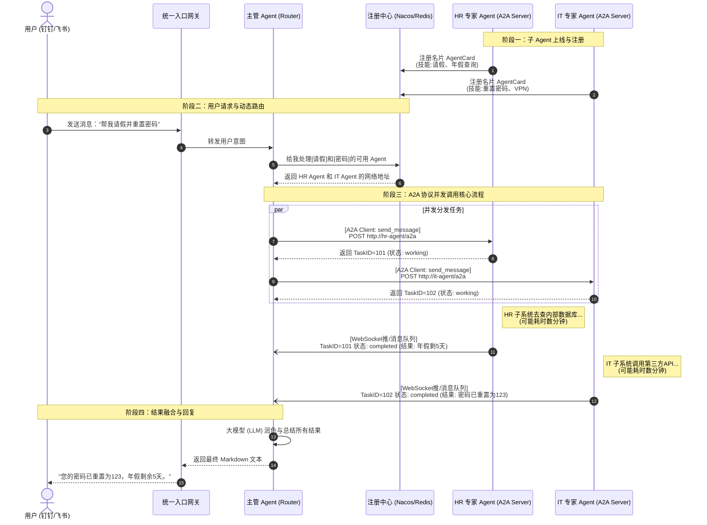

```mermaid
sequenceDiagram
    autonumber
    
    actor User as 用户 (钉钉/飞书)
    participant Gateway as 统一入口网关
    participant Router as 主管 Agent (Router)
    participant Registry as 注册中心 (Nacos/Redis)
    participant HR as HR 专家 Agent (A2A Server)
    participant IT as IT 专家 Agent (A2A Server)

    %% 阶段一：服务注册
    note over HR, IT: 阶段一：子 Agent 上线与注册
    HR ->> Registry: 注册名片 AgentCard <br/> (技能:请假、年假查询)
    IT ->> Registry: 注册名片 AgentCard <br/> (技能:重置密码、VPN)
    
    %% 阶段二：用户请求与路由发现
    note over User, Registry: 阶段二：用户请求与动态路由
    User ->> Gateway: 发送消息："帮我请假并重置密码"
    Gateway ->> Router: 转发用户意图
    
    Router ->> Registry: 给我处理[请假]和[密码]的可用 Agent
    Registry -->> Router: 返回 HR Agent 和 IT Agent 的网络地址
    
    %% 阶段三：A2A 协议交互 (基于 JSON-RPC 和长耗时任务)
    note over Router, IT: 阶段三：A2A 协议并发调用核心流程
    par 并发分发任务
        Router ->> HR: [A2A Client: send_message]<br/>POST http://hr-agent/a2a 
        HR -->> Router: 返回 TaskID=101 (状态: working)
        
        Router ->> IT: [A2A Client: send_message]<br/>POST http://it-agent/a2a
        IT -->> Router: 返回 TaskID=102 (状态: working)
    end
    
    %% 长耗时任务回调机制 (A2A 解决的痛点)
    note right of HR: HR 子系统去查内部数据库...<br/>(可能耗时数分钟)
    HR -) Router: [WebSocket推/消息队列]<br/>TaskID=101 状态: completed (结果: 年假剩5天)
    
    note right of IT: IT 子系统调用第三方API...<br/>(可能耗时数分钟)
    IT -) Router: [WebSocket推/消息队列]<br/>TaskID=102 状态: completed (结果: 密码已重置为123)
    
    %% 阶段四：汇总回复
    note over User, Router: 阶段四：结果融合与回复
    Router ->> Router: 大模型 (LLM) 润色与总结所有结果
    Router -->> Gateway: 返回最终 Markdown 文本
    Gateway -->> User: "您的密码已重置为123，年假剩余5天。"

```